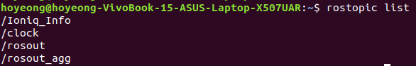

# Artiv만의 Custom message를 사용해보자. (for ROS1)
여호영 / 2020.05.15

현재 ARTIV만의 Custom message가 많이 작성되었는데 각 message를 어떻게 사용해야할까?    
ROS1, ROS2에 따라서 message를 어떻게 사용해야하는지 알아보자!(현재 페이지는 ROS1, Artivmsg.msg 기반으로 작성되었다.)    
Custom message의 설명은 다음 링크에 있으니 용도에 맞는 message를 사용하자.    
너무 기초적인 Ros python 코드 설명은 생략하겠다.(궁금하면 물어보도록)    
혹시나 Custom Message는 어떻게 만들어요? 라는 질문을 한다면 다음 [링크](https://github.com/shinkansan/ARTIV/blob/master/ROS/make_custom_msg.md)로...

## Full Code
실제 쓰이는 파이썬 코드는 너무 길기 때문에 따로 [링크](https://github.com/shinkansan/ARTIV/blob/master/Comms/Ioniq/dbw_ioniq/dbw_ioniq_node/dbw_ioniq_node.py)를 걸어둘 것이다.    
설명은 위 링크에 있는 코드로 할 것이다. 같이 보면서 따라오길.    

## Import List
우리는 Artivmsg.msg라는 Custom message를 사용할 것이므로 다음과 같은 import를 추가.    
```
from candb.msg import Artivmsg      #candb/msg 디렉토리에 있는 Artivmsg.msg를 이용
```

## Publish
Custom message를 Publish 또는 Subscribe 할 수 있는데 우선 Publish에 대한 내용만 다루고, Subscribe 내용은 추후에 추가할 예정이다.    
위에 제시된 Full Code에서 'rosPub'이라는 class를 보자.(주 내용)    

### 1. initialization
```self.ArtPub = rospy.Publisher('Ioniq_Info', Artivmsg)```    
위 코드는 'Artivmsg'라는 타입의 메시지를 이용해서 'Ioniq_Info'라는 Topic을 만들어낸다는 의미이다.    
무슨 종류의 message를 publihsh 할 것인지 언급하는 것이다.    

### 2. data_parser
함수 이름 그대로 data를 parsing하는 함수이다.    
각 요소들은 반복되므로 하나만 가지고 설명을 하겠다.    
```
self.AGMsw = data['AGMsw']
```
위 예시가 의미하는 바는 다음과 같다.    
데이터베이스파일(.dbc)에서 'AGMsw'라는 이름으로 정의된 데이터는 class내에서 AGMsw라는 변수에 저장하겠다.    

### 3. data_pub
이 또한 함수 이름 그대로 data를 publish하는 함수이다.    
이 함수는 data_parser함수에 의해 parsing된 data를 어떤 msg의 요소로 publish될 것인지 정해준다.    
```
artmsg = Artivmsg()

artmsg.agm_switch = int(self.AGMsw)
...

self.Artpub.publish(artmsg)
```
'artmsg'는 Artivmsg를 load 하는 기능인 것 같다.    
그 후에 'artmsg' 내에 'agm_switch'라는 이름을 가진 요소에 이전에 정의했던 'self.AGMsw'의 변수를 입력해준다.    
마지막으로 'artmsg' 내의 모든 요소에 수치가 입력된 후에 'artmsg'를 Artpub에 따라 publish 한다.    

위의 설명 외에도 다른 함수들이 많이 정의되어 있는데, 이는 CAN 통신을 통해 직접 정보를 받아와서 pulbish하기 위함이다.    
만약 정보가 기록된 rosbag을 이용한다면 굳이 다른 함수까지 고려할 필요는 없다.    

## 실행
roscore, rosbag(Artivmsg로 녹화된 파일) 실행 후에 ```rostopic list``` 입력하면    
    
사진과 같이 '/Ioniq_Info'라는 이름의 topic이 출력되는 것을 볼 수 있다.    
추가적으로 ```rostopic info /Ioniq_Info```를 통해 topic의 정보를 확인해보면 canDB라는 이름의 패키지의 Aritvmsg로 publish되고 있는 Topic이라고 나온다.

마지막으로 어떻게 message가 publish되고 있는지 확인하기 위해 다음과 같이 패키지의 setup파일로 source를 해준다.
```
cd [ros1_workspace]
source devel/setup.bash
```
이후에 ```rostopic echo /Ioniq_Info``` 입력을  통해서 publish되고 있는 정보를 확인한다.    


## Custom message를 사용할 때 유의할 점.
1. Custom message를 통해서 만들어진 Topic은 Ros1-Ros2 bridge를 통과하지 못한다.    
이유는 모르겠지만 Ros1, Ros2에 같은 이름의 패키지, 같은 내용의 msg파일을 만들어서 빌드해도 Ros2에서 인식하지 못한다.    
이는 Ros1을 아직까지 쓰는 가장 큰 이유이다... Rosbag은 Ros1에서 밖에 없기 때문에...    
시간이 지난다면 Ros2용 Rosbag이 나오거나 Bridge에 Custom message를 통과시킬 수 있는 솔루션이 나오겠지?    
**Ros1 msg는 Ros1 내에서만!**    

2. Rosbag을 이용하는 경우, Rosbag를 만들어내는 데에 사용된 msg가 저장되어 있는 패키지 이름의 영향도 받는다.    
무슨 말인고 하니 현재 Rosbag에는 여러 버전이 있는데 Rosbag의 정보에 관한 [페이지](https://github.com/shinkansan/ARTIV/blob/master/rosbag/rosbag_info.md)를 보면 알겠지만 패키지 이름이 바뀌는 순간이 있다.    
이유는 패키지 이름에 대문자가 포함되면 생기는 오류 때문에 이름 변경이 불가피했기 때문이다.    
하여튼 이러한 변화 때문에 canDB 내의 Artivmsg로 녹화된 Rosbag은 candb 내의 Artivmsg로는 받아들일 수 없다.    
