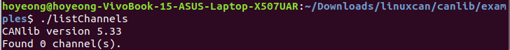

# Kvaser 전용 프로그램 도움 없이 CAN 정보를 받아오자!
Date : 2020.06.23    
Author : 여호영

### 이전의 문제점
이전에는 Kvaser사의 linuxcan, kvlibsdk라는 파일을 다운 받아서 설치하는 과정을 거쳐 CAN 정보를 다룰 수 있었다.    
하지만 고질적인 문제점이 하나 있다면 가끔 가다가 개인 노트북을 인식하지 못한다는 것이다.    
다음 사진과 같이 Kvaser 케이블을 연결했음에도 채널이 검색되지 않는 오류가 발생한다.    


    

## 해결책은 Socketcan!
Kvaser사의 전용 툴이 아닌 ROS Package를 이용해 CAN 통신 연결 오류를 없애고자 한다.    
그 해결책으로는 ROS 공식 Package인 ros_canopen을 사용하는 것이다.     

### Download ros_canopen Package
우선 다음 git 명령어로 ros_canpoen 패키지를 다운받자.    


```git clone https://github.com/ros-industrial/ros_canopen.git```    


물론 그냥 [사이트](https://github.com/ros-industrial/ros_canopen)에서 zip 파일을 다운 받아서 압축을 풀어도 된다.     
참고로 다운 받는 위치는 workspace내에 src 폴더이다.    
다운로드가 완료되었다면 ~/(workspace) 폴더에서 catkin_make를 진행한다.    
그럼 갑자기 muparser가 없다면서 오류가 뜰 수 있다!    
그렇다면 당황하지 않고 다음 명령어를 순서대로 입력한다.    


```sudo apt-get update -y```    
```sudo apt-get install -y libmuparser-dev```     

### 컴퓨터와 CAN 장치 연결
*참고로 이 과정은 [Voyage](https://news.voyage.auto/an-introduction-to-the-can-bus-how-to-programmatically-control-a-car-f1b18be4f377) 사이트를 참고했다.*    
Kvaser사의 CAN 선을 컴퓨터에 연결하였다면 다음 명령어를 순서대로 입력한다.    


```modprobe can```    
```modprobe kvaser_usb```    
```ip link set can0 type can bitrate 500000```    
```ifconfig can0 up```    


만약 위 과정 중에 Permission에 대한 오류가 발생하면 명령어 맨 앞에 sudo를 붙이자!    
위 과정이 성공적이라면 CAN 연결은 끝났다.    
아래의 마지막 명령어를 입력해 CAN 정보를 받아올 수 있다.    


```candump can0```    


참고로 위 명령어는 단지 CAN Bus를 Monitoring하는 명령어이며 필수는 아님.    

### CAN raw data를 ros에 publish! (별 다섯개)
CAN 정보를 수신하기 위한 마지막 단계로, 이를 위해서 이때까지 고생했으니 조금만 더 힘내자.    
우선 source 후에 roscore를 실행해야 한다.(ros1 기준)    
다운받은 ros_canopen 패키지의 workspace로 이동하자.    


```cd ~/(workspace)```    
```source devel/setup.bash```    


패키지로 가기 전 workspace에서 위 명령어로 workspace에 source를 해주자.(이유는 알겠지?)    
이유는 workspace 내의 새로운 src 및 include 파일을 인식해야하기 때문이다.    
그 후에 다음 예제를 실행함으로써 can raw data를 ros에 publish하자!    


```rosrun socketcan_bridge socketcan_to_topic can0```    


위 명령어를 실행 후에 rostopic list 중에 /received messages가 있으면 성공이다!    
topic의 정보를 보면 알겠지만 메시지 타입이 can_msgs/Frame이므로 주의하길 바란다.(source 등등...)    

## 추후 계획
이제 kvaser 전용 툴 없이도 can raw data를 받아올 수 있다.    
그러므로 다른 팀의 개발을 위해 CAN DB에 맞게 data를 parsing하는 프로그램이 필요하다.    
이는 오늘 내에 개발될 예정이니 걱정하지 말도록.    
