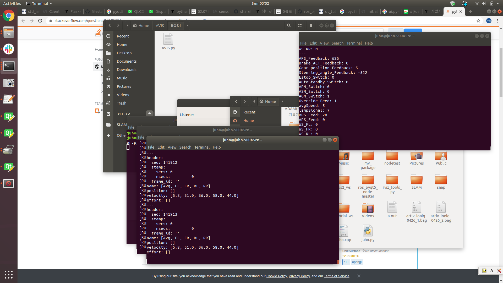

# IONIQ DBW Communication Node
Author : Hoyeong Yeo, Gwanjun Shin

## Condition
1. ROS Melodic... (2 is on plan)
2. Python2

## Contents
  1. Artivmsg file : Vehicle DBW ros msg   
    Author : Hoyeong Yeo
    
  2. Ioniq can db    
    artiv_canDB_Ioniq_v1.dbc
    
  3. executable node   
    canDB > src > dbw_ioniq_nod.py
    
  4. Publish Node   
    /Ioniq_Info
    
 
 
 
## rosbag

ARTIV rosbag data server [link](http://gofile.me/4o0Gn/k9ZL0YGhc)
