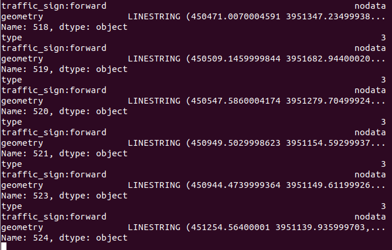
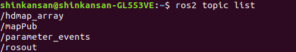

## Parser 제작 및 ARTIV HD Map msg 제안

### [hdmap 분석 주피터 노트북](./hdmap_package_part1.ipynb)
  **관련 내용은 주피터 노트북 참고**   
  
### [hdmap 전용 자체 paser_server](./parser_server.py)

이 parser_server는 [hdmap_msg](../hdmap_msg) 설치해야 동작합니다. **map 구조 링크 참고**   


_(동작 화면)_

1. 필요파일 : dgist_a1.geojson (수정 버전, 새로운 type 적용)   
2. 동작방식 : HD MAP을 읽고, 이를 hdmap_msg/HdmapMarker -> HdmapArray msg타입으로    
Topic: /hdmap_array로 Publish 합니다.      

> Marker는 한 타입의 집합체   
> Array는 타입들의 집합체로 구분하였습니다.

3. Pub Data 사진
  자세한 형식은, hdmap_msg에서 확인가능
  
  
 ```
 - header:
    stamp:
      sec: 1586938626
      nanosec: 739852523
    frame_id: ''
  ns: ''
  id: 124
  type: 3
  action: 0
  pose:
    position:
      x: 0.0
      y: 0.0
      z: 0.0
    orientation:
      x: 0.0
      y: 0.0
      z: 0.0
      w: 0.0
  scale:
    x: 0.2
    y: 0.2
    z: 0.2
  color:
    r: 0.0
    g: 0.0
    b: 0.0
    a: 0.0
  points:
  - x: 451241.8979996458
    y: 451241.8979996458
    z: 0.0
  - x: 451241.9690002869
    y: 451241.9690002869
    z: 0.0
  - x: 451242.57300043927
    y: 451242.57300043927
    z: 0.0
  - x: 451243.477999597
    y: 451243.477999597
    z: 0.0
```
