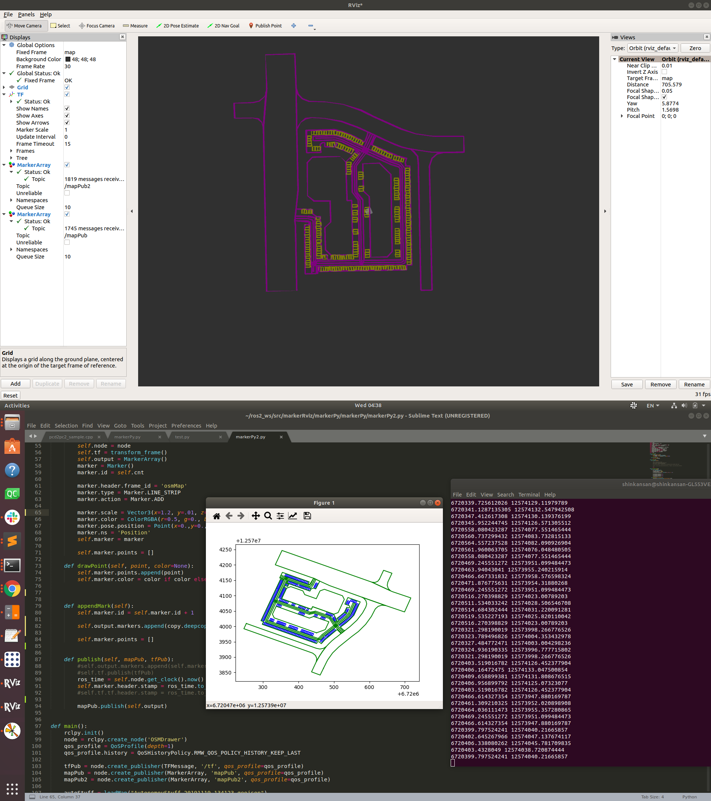
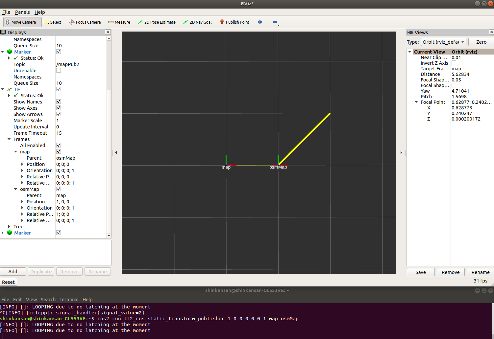
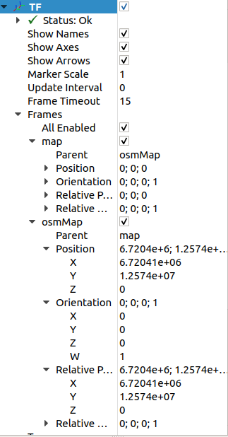

# MarkerPy
Author : Gwanjun Shin

OSM 기반 파일 RVIZ시각화 예제

---
### 디펜던시
1. rclpy   
2. osmnx
3. geopanda


### 코딩 유의점
이 이유 때문에 상당히 삽질을 오래했었는데,    
원래 위도 경도 그대로 출력하고 싶었으나, Rviz가 1E-6 이상의 변화를 시각화하지를 못해서 UTM 좌표계를 변환하고 사용하였음.
`self.mapLoad = self.mapLoad.to_crs(epsg=32652)`
UTM 좌표계는 변화량이 1이상이어서 Rviz로 보기 편했다.

### Copy의 중요성 
리스트에 변수를 Append 할 때는 deepcopy를 꼭 이용하자, 이를 까먹었다가, 계속 자료가 지워지는 진풍경을 볼 수 있었다.
```python

	def appendMark(self):
		self.marker.id = self.marker.id + 1
		
		self.output.markers.append(copy.deepcopy(self.marker))

		self.marker.points = []
  ```
  
  ### Marker는 구조체 (Class) 등을 이용하는 코딩 방식 애용하기
  처음에 짤 때부터 subclass 방식으로 작성하였는데 marker의 근본을 수정할 때 편했다. 이런 방식으로 코딩하는게 ROS에서도 권장한다카더라
  
  
  
  ### 스크린샷
  
  
  
  
  ###  실행 시 참고
  
  static_transform을 실행해야하는데
  
  위의 사진의 아래부분 콘솔창을 보면 명령어가 보인다.
  
 `ros2 run tf2_ros static_transform_publisher 6720409 12574038 0 0 0 0 1 map osmMap`
 
 tf의 의미를 이제 부터 알 필요가 있다.
 
Rviz를 처음킬때 나오는 'map' 에다가 내가 맵을 출력하는 프레임인 osmMap의 관계를 정해줘서 map을 출력해도 osmMap이 보여지게 만들어준다.
그리고 위의 6720409 12574038 0 0 0 0 1 은 차례대로 `x y z qx qy qz qw` 인데  x y z 일종의 오프셋이다. osmMap과 map의 차이

우선 osmMap 을 출력을 UTM 좌표계를 그대로 출력했다. 그래서 x, y과 6720409 12574038 저정도 된다. 그래서 정확할 필요는 없고 내가 출력하는 값들이 노는 언저리 값을 넣어주면 된다

그리고 rviz에서 tf를 추가하면 
 처
  
