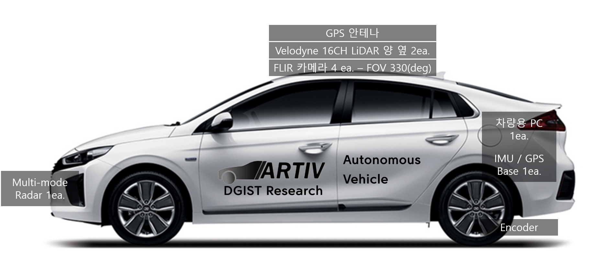

# 
DGIST ARTIV Repos

## Developer Zone
잠깐! 우분투가 처음이라고요? [매뉴얼](./Manual) 좀 보고와서 얘기합시다.
> ### OS : Ubuntu 18.04
> ### Langs : 1) C++14  2) Python3
> ### Main IDE : qt creator
> ### MiddleWare : ROS2-Dashing, ROS1-Melodic 

## Vehicle Layout
Hyundai IONIQ 2019   

## Sensor Layout
Hyundai IONIQ 2019   

