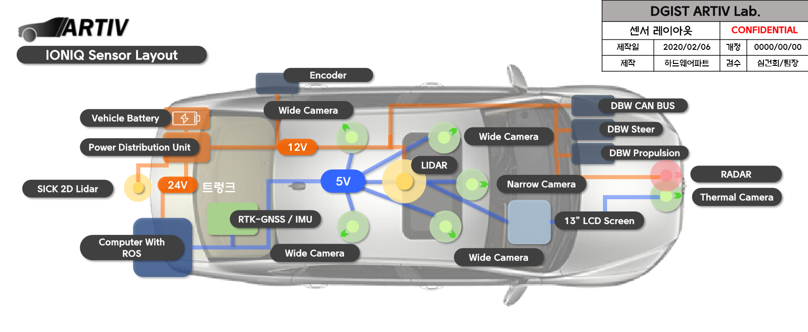

# 
DGIST ARTIV Repos

## Developer Zone
잠깐! 우분투가 처음이라고요? [매뉴얼](./Manual) 좀 보고와서 얘기합시다.
> ### OS : Ubuntu 18.04
> ### Langs : 1) C++14  2) Python3
> ### Main IDE : qt creator
> ### MiddleWare : ROS2-Dashing, ROS1-Melodic 

### 고용량 데이터 공유용 지정 파일서버
Dedicate Server address
> [ktk1501.synology.me:5000](http://ktk1501.synology.me:5000)   
> Confidential ID : artiv, pw : dgist1234

### 팀별 폴더 안내

1. 차량 제어 및 통신 그리고 주행 관련 서류를 보고 싶다면?    
  하드웨어/통신 파트 [./comms](./Comms).  
1. ROS로 개발 시에 좋은 툴, 예시, 코딩 컨벤션 그리고 통합 SW를 쓰고싶다면?   
  통합 SW 파트 [./integraedSW](./integraedSW).  
1. 딥러닝으로 객체 인식 논문 및 환경 셋팅 방법을 알고 싶다면.  
  컴퓨터 비전 파트 [./Vision](./Vision).  
1. 고정밀 지도와 관련 툴킷, GPS IMU 사용 방법을 알고싶다면?   
  위치측위 파트 [./HDmap](./HDmap).  
1. 제어기와 Path-Planning 알고리즘을 보고싶다면.  
  주행제어 파트 [./Control&Plannign](./Control&Planning).  
1. 라이다를 이용한 객체 검출과 추적에 대해 보고싶다면.  
  라이다 파트 [./lidar&radar](/.lidar&radar).  
1. 특정 상황을 녹화한 rosbag 을 다운받고 싶다면.  
  rosbag [./rosbag](./rosbag).  
1. 우분투 설치 방법이나 기타 매뉴얼을 보고싶다면.  
  HoneyTip, Manual [./honeytip](./honeytip) [./Manual](./Manual).     
1. 각종 센서 설치 방법과 마운트 설계를 알고싶다면?   
  Sensors [./Sensors](./Sensors).  
1. ROS 기초를 배우고싶다면?   
  ROS [./ROS](./ROS).  
1. ARTIV 블로그 글쓰고 싶다면?   
  docs [./docs](./docs).  

## Vehicle Layout
Hyundai IONIQ 2019   

## Sensor Layout
Hyundai IONIQ 2019   

