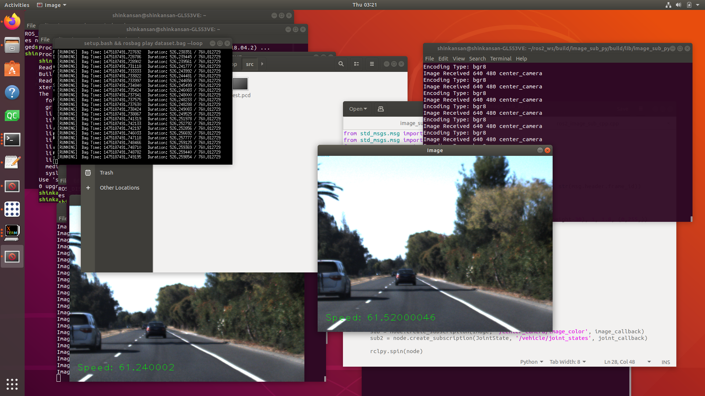

# Making Subscriber & Publisher Package
Author : Shin



Left Window : run by CPP
Right Window : run by Python

Based on Udacity ROSBAG Open Dataset

***
 

### In this chapter you need to make Publisher and Subscriber

어려울 것 같지만 앞으로 할것에 비하면 쉽다!

Goto `image_sub_cpp` & `image_sub_py`로 들어가자, 아마 전 챕터 (패키지 만들기)를 했다면 어디에 핵심 코드가 있는지 알 것이다!.

> 코드 디펜던시 안내   
> 아래를 읽고 Cpp의 camkefile에서는 실제 실행에서는 필요없는 PCL 관련 라이브러리 명시되어 있습니다. 지우고 실행하셔야합니다.   
> 이 코드에는 OpenCV 4.3.0 을 이용하였습니다. build 혹은 어떤 방법이든 설치는 해야돌아갑니다.    

> 기타 데이터셋   
> 아래 코드는 Udacity의 자율주행데이터셋 rosbag (40G) 기준으로 동작합니다.   
> 


## CMAKE 101

추가적으로 여기서는 디펜던시 추가를 위한 Cmake 기초 지식이 요구된다!, 공부하지 않더라도 차피 오류 해결하면서 배울 것이다.
[여기 아주 잘 정리되어 있는 문서](https://gist.github.com/luncliff/6e2d4eb7ca29a0afd5b592f72b80cb5c) 를 보면 Visual Studio 빼고는 쓰레기라는데 

맞는말이다. 이 것을 무작정하면 안되고
Python도 버전이 있듯이 C++도 컴파일러가 다양하다. 그래서 우리는 ROS2에 사용되는 `ament_cmake`를 사용할 것이다. 추가적으로 ROS1는 `catkin`을 많이 쓴다.
   
C++ 적용의 좋은점은, 파이썬보다 코드자체가 버전을 잘 안타서 ROS2에서 작성하다가 잘 안되서 혹은 사용하는 디펜던시가 ros1만 지원되는 상황이라면 과감하게 ros2에서 작성하던 코드를 쭉 긁어와서 ros1에서 컴파일을 할 수 있는 것이다. 물론 CmakeFile을 catkin 버전으로 수정해야되지만., 또 물론 rclcpp가 아니라 ros.h 로 바뀐다.

우선 cmakefile에 대한 개념을 위 글에서 이해했다면 이제는 ros1의 catkin 컴파일러 버전을 보도록 하자 [링크](http://wiki.ros.org/ko/ROS/Tutorials/catkin/CreatingPackage)

그 다음은 ros2의 ament이다. [링크](https://index.ros.org/doc/ros2/Tutorials/Ament-CMake-Documentation/)

보다 보면 어려울텐데, cmake 구조는 다 비슷하고 결국 LIB, Dependency 추가로 골머리를 앓기전에 어떻게 검색해야되는지 키워드만 알겠다는 식으로 보면된다. 

실제로 하다보면 include 한 디펜던시가 `no file or such ~` 오류가 나오면 대부분 너네가 make install을 안하거나, cmake에 추가를 안해서이다.


그래서 끝 챕터는 아마 우리 통합 SW팀이 ROS에 QT Creator라는 예쁜 IDE를 소개시켜줄것이다.


## 각 코드의 핵심 라인

### CPP
그냥 붙여넣은걸로 당연히 문법은 안맞다.
```C++

void image_callback(const sensor_msgs::msg::Image::SharedPtr msg){
 image_show(msg);
 //msg의 구조는 직접 코드에 들어가서 image_show를 보자  CPP의 openCV는 이미지 매트릭스 .. Mat를 직접 설정해야되서 복잡하게 보일 수 있지만
 // 어렵지는 않다. 걱정말고 한줄씩 읽어보자.
}

void joint_callback(const sensor_msgs::msg::JointState::SharedPtr msg){
 currentSpeed = msg->velocity[0];
 //msg는 구조체처럼 되어있다. 그래서 참고 링크를 아래에 넣었다 보자.
 
 //cout << currentSpeed << endl;
}

// main문
rclcpp::init(argc, argv); //의례적으로 넣는 init 부분이다.

auto node = rclcpp::Node::make_shared("sub_image_sample"); //모두 이제 node라는 개념을 알텐데, ros를 사용하는 한 쓰레드당 한 노드를 부여한다고
//보면된다. 단! 이 것은 ROS2 개념이고, 즉 다중 쓰레드면 한 프로세스 여러 노드가 존재 할 수 있다.    
//하지만 ROS1은 한 프로세스에 무조건 한 노드이다.
// 위 코드를 한 프로세스에서 1번을 넘어 실행하면 죽는다. 그래서 왠만해서는 1프로세스 1노드로 작성하자.
// 안에 들어가는 텍스트는 노드의 이름으로 구별할 때도 작성한다. 그래서 명시적으로 작성하도록 하자. 
  
auto sub = node->create_subscription<sensor_msgs::msg::Image>("/center_camera/image_color", image_callback);
auto sub2 = node->create_subscription<sensor_msgs::msg::JointState>("/vehicle/joint_states", joint_callback);
// ROS에는 msg 라는 노드간 데이터를 전송하는 것이 있는데, 다양한 규격들이 있다. 상세한것은 아래에 따로 설명, 그래서 여튼 Subscript 정보를 
// 받아온다는 말인데. 받아올 때 그 토픽에 맞는 타입을 적어줘야한다. 템플릿 작성된 것을 볼 수 있다.
//callback은 생소할 수 있는데 말그대로, Topic에 정보가 새로 등록되면 발동되는 함수이다. 위에 함수처럼 작성되어 있고, 자동으로 그 토픽의 msg가
// 인자로 들어가는 것을 볼 수 있다.

rclcpp::spin(node);
//Subscription은 자체적으로 무한루프로 돈다. Spin이 오면 그 때부터 callback이 발동한다. 즉 Spin을 해야 루프가 발동을 한다.
//rclcpp::rate라는 구문도 사용할 수 있다. 이는 refresh 주기를 직접 설정할 수 있다.

rclcpp::shutdown();
```

파이썬도 비슷하니 대조하면서 보도록 하자

* joint state msg의 구조 : http://docs.ros.org/api/sensor_msgs/html/msg/JointState.html
* sensor msg 타입 (ros1) : http://wiki.ros.org/sensor_msgs --> std_msgs 타입도 있으니 한번 보자

그리고 마음에드는 msg 타입이 없으면 msg도 우리가 직접 만들 수 있다. 이건 해당되는 파트가 공부하길 바람.
