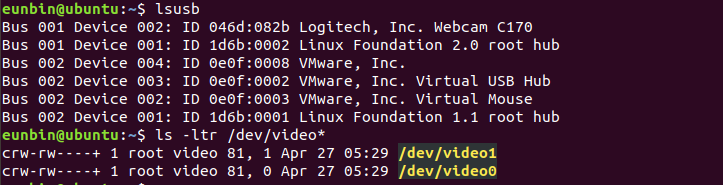
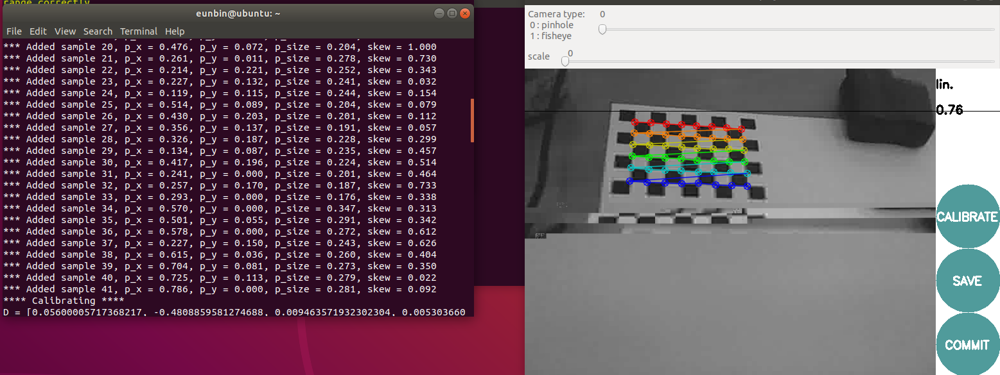

# Ros camera calibration
> reference: http://wiki.ros.org/camera_calibration/Tutorials/MonocularCalibration

### setting
1. intstall uvc-camera pkg or usb_cam pkg
~~~(bash)
sudo apt-get install ros-melodic-uvc-camera
sudo apt-get install ros-melodic-image-*
sudo apt-get install ros-melodic-image-view
~~~
내 컴퓨터는 usb_cam pkg를 이용했다.
2. OpenCV camera calibration
OpenCV를 설치하자. 다음 링크를 참고한다. https://sunkyoo.github.io/opencv4cvml/OpenCV4Linux.html
3. camera가 잘 연결되는지 확인해보자.
~~~(bash)
lsusb
ls -ltr /dev/video*
~~~
잘 연결되었을 시에 다음과 같은 메시지가 출력될 것이다.

### Run!
1. ros1을 키고, roscore를 켜준다.(모두가 알죠? source /opt/ros/melodic/setup.bash 모르면 이 [링크](/ROS/readMe.md)타고 들어가서 공부해오세요.)
2. 또 다른 창에 ros1을 키고, 다음 명령어 입력
~~~(bash)
rosrun uvc_camera uvc_camera_node 
~~~
or
~~~(bash)
rosrun usb_cam usb_cam_node
~~~

3. 노드를 실행시키면 camera calibration file이 없다는 내용으로 warning이 뜬다. camera.yaml 파일을 생성하자

4. 3번까지 진행한 후, 확인해야하는 항목이 있다.
~~~(bash)
rostopic list
~~~
후 /camera_info가 /camera 하위에 있는지 / 하위에 있는지 확인해야한다. 다음과 같이 나오면 된다.

5. camera calibration을 실행시키자. 샘플 데이터를 얻어오자.
~~~(bash)
rosrun camera_calibration cameracalibrator.py --size 8x6 --square 0.024 image:=/usb_cam/image_raw camera:=/
~~~
4번에서 만약 /camera/camera_info로 나온다면, 마지막 항목을 camera:=/camera로 수정해야한다.
~~~(bash)
rosrun camera_calibration cameracalibrator.py --size 8x6 --square 0.024 image:=/usb_cam/image_raw camera:=/
~~~
잘 실행된다면, 다음과 같이 sample data를 얻을 수 있을 것이다.

