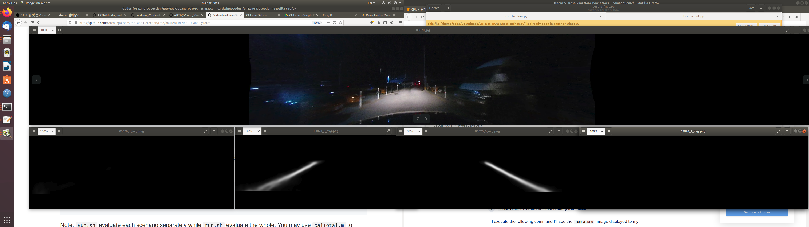
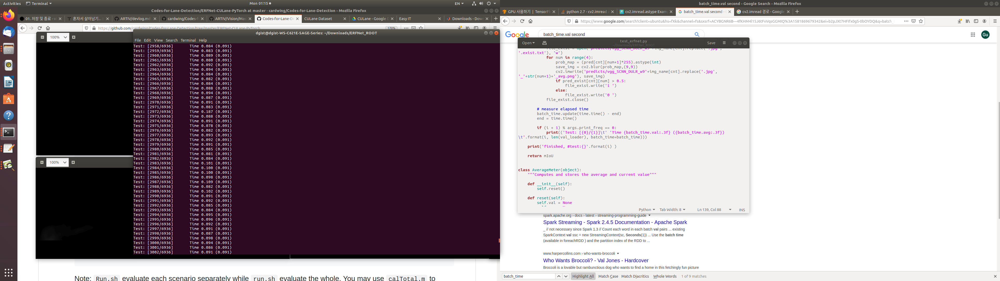

# Learning Lightweight Lane Detection CNNs by Self Attention Distillation
[github](https://github.com/cardwing/Codes-for-Lane-Detection)  
[sota paper](https://arxiv.org/abs/1908.00821)

Author : Eunbin Seo  
Date : 2020.02.16. ~ 2020.02.17.

we follow the [github](https://github.com/cardwing/Codes-for-Lane-Detection/tree/master/ERFNet-CULane-PyTorch). So, we need to download the whole dataset about CULane at this [link](https://drive.google.com/drive/folders/1mSLgwVTiaUMAb4AVOWwlCD5JcWdrwpvu). 

## Dependencies
First, we have to install tensorflow-gpu and torch.
~~~(bash)
pip install tensorflow-gpu==1.14.0
pip install torch===1.2.0 torchvision===0.4.0 -f https://download.pytorch.org/whl/torch_stable.html
~~~

## Problems & How to solve the problems
1. No argument --npb
--> we can solve it by erasing this line in test_erfnet.sh.
~~~ bash
--npb\
~~~

2. RuntimeError: cuda runtime error (38)  
--> we can solve it by adding only two lines in test_erfnet.py.  
I got help on this [link](https://www.tensorflow.org/guide/gpu?hl=ko)
~~~ python
import tensorflow as tfs

tfs.config.set_soft_device_placement(True)
tfs.debugging.set_log_device_placement(True)
~~~

3. AttributeError: 'NoneType' object has no attribute 'astype'  
This error happens at cv2.imread(os.path.join(~)) in test_erfnet.py  
--> This error happens because the path is wrong. We have to compare "ERNet_ROOT/list/test_img.txt" file with "os.path.join(self.img_path, self.img_list[idx])".

## Today's outcome
### lane detection

--> I think this model detects lanes well even though test image is the night picture!!!

### But we have to solve fps problem....

--> It has only 10fps....  
According to the paper, performance is 111fps by using this model. I hope our performance reach the 111fps!

## To do
1. algorithm
2. Think about how to draw the smooth lane

