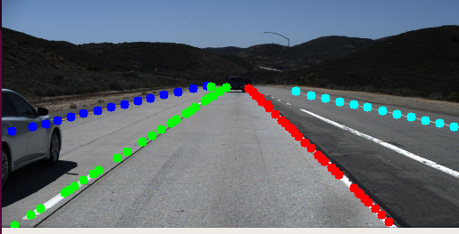
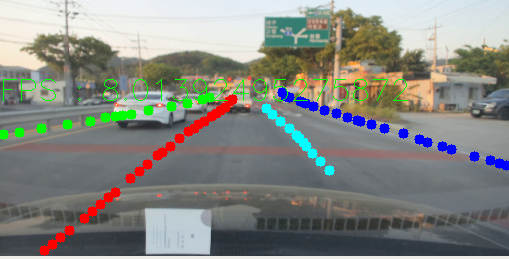

# Key Points Estimation and Point Instance Segmentation Approach for Lane Detection
[github](https://github.com/koyeongmin/PINet)  
[sota paper](https://arxiv.org/pdf/2002.06604.pdf)

Author : Eunbin Seo  
Date : 2020.04.28. ~ 2020.04.29.

we follow the [github](https://github.com/koyeongmin/PINet). So, we need to download the test, train TuSimple dataset at this [link](https://github.com/TuSimple/tusimple-benchmark/issues/3). 

## Problems & How to solve the problems
1. TypeError: new() received an invalid combination of arguments - got (float, int, int, int), but expected one of: * (torch.device device) * (torch.Storage storage) * (Tensor other) * (tuple of ints size, torch.device device) * (object data, torch.device device)  
--> util_hourglass.py
line 49, 75, 100, in_channels//4  --> int(in_channels//4)
from line 175에서 int operation int를 하면 float으로 반환해주기 때문에 (out_channels//2)를 int(out_channels//2)로 바꿔줘야한다.

2. TypeError: 'float' object cannot be interpreted as an integer
from parameters.py line 18, 19 ---> change the word to number 64, 32

## Today's outcome
### lane detection
mode 0: test the code

--> I think this model detects lanes well in Tusimple dataset.
mode 1: run our video

#### But we have to solve some problem....
--> 직접 찍은 영상을 돌려본 결과인데, 끝쪽의 lane과 연석을 인식하는데 어려움이 있고 fps가 그렇게 높지 않다.(그 이유는 ~~GPU를 줘도 사용을 못하고 있는 상황이라서 이겠지...~~) fps는 최소 6fps~

## To do
1. GPU 최대 사용 필요
2. 교차로에서 lane 생성을 하면 안됨.
3. 영상은 차 보닛이 나오지 않게 잘라줘야 함. (외란이 많아질 수 있음)
4. 우리의 dataset을 TuSimple 형식으로 annotation

