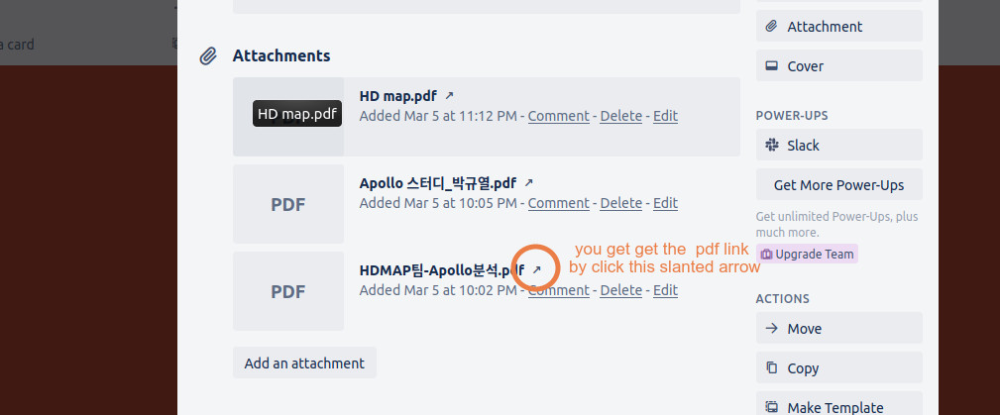

# ARTIV Blog guidline

1. Pdf Viewer   
  Example :  https://shinkansan.github.io/ARTIV/teams/hdmap/apollo_analysis.html
  Source : https://github.com/shinkansan/ARTIV/blob/master/docs/teams/hdmap/apollo_analysis.md
  
  You can add PDF viewer to your article with   
  `<embed src="{YOUR_PDF_EXTERNAL_LINK}" type="application/pdf" width="100%" height="800px"/>`
  
__YOUR_PDF_EXTERNAL_LINK__ is a trello pdf link   
You can get this link by 

  
  
