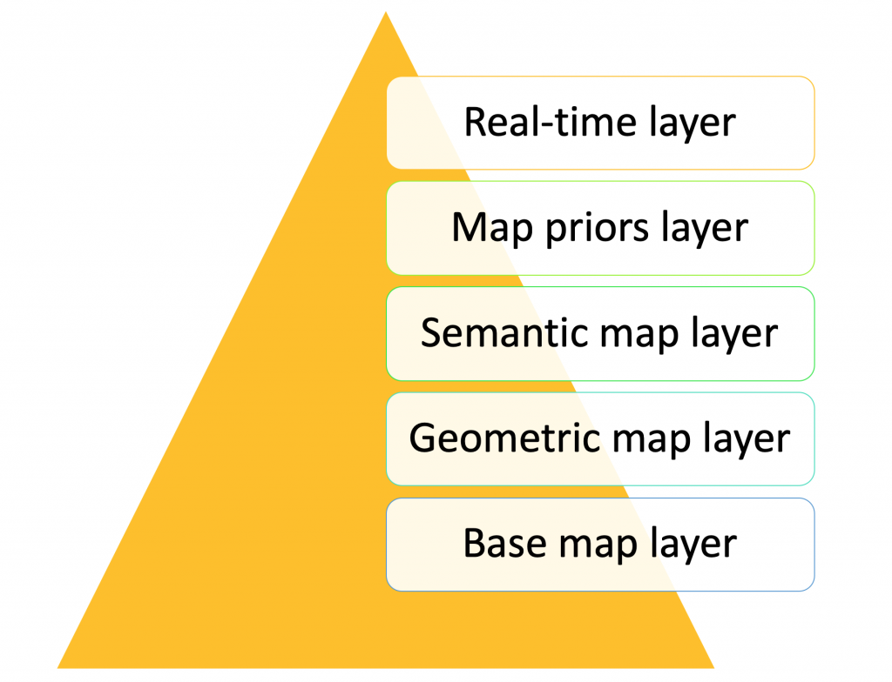
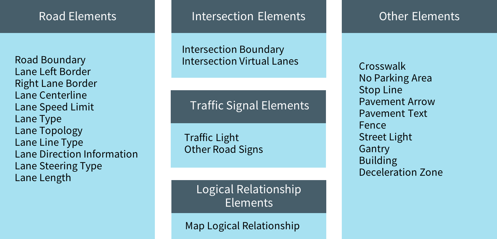
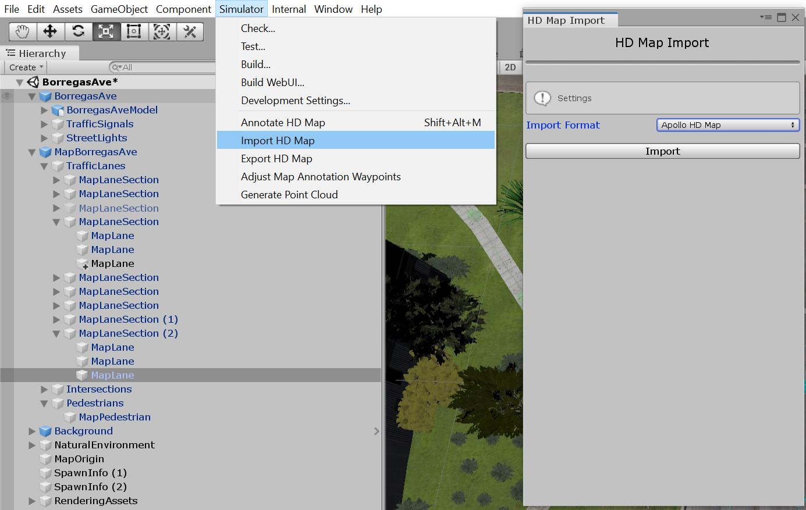

# HD Map과 다른 OpenPlatform의 HD Map 비교해보기
Author : 신관준 / 2020.02.25.

## Introduction
지금 시중에 풀려있는 차들은 반자율주행이라는 표현을 쓰는데, 대부분 레이더와 카메라를 이용하여 ADAS, LDA, LKAS 같은 반자율주행 기능들을 자동차에 탑재한다.   
좋은 기능들이지만, 여전히 자동차는 앞의 상황만을 센서로 의존하면서 동작하고 다양한 도로상황에 대처하지 못하는 문제점들이 많다. 그래서 결국
자율주행 LV 3 이상으로 갈려면 HD Map 혹은 그에 대응하는 위치측위 시스템이 필요하다. 자동차가 스스로 앞에 뭐가 있는지 혹은 어떤 Traffic Infra가 있는지 알고
대응하는 움직임은 지금의 반자율주행과는 훨 다를 것이다.

## Open Platform
2020년 현재 다양한 자율주행 오픈플랫폼이 있다. Baidu의 [__Apollo__](https://github.com/ApolloAuto/apollo), TierIV의 [__Autoware__](https://gitlab.com/autowarefoundation/autoware.ai), Comma AI의 [__OpenPilot__](https://github.com/commaai/openpilot)   
모두 기트허브/랩에 공개되어 있으며
착하게 도커로 공개하며 손쉽게 시험해 볼 수 있도록 되어있다.

우선 개발 일정과 자율주행 기능구현을 위해서는 HD MAP에 있어서는 이미 존재하는 규격을 맞추어 진행하는 것이 합리적이라는 본 파트는 위 3개의 플랫폼에서   
수정과 개발이 편하고, 특정 기능의 도입과 호환성이 좋은 HD Map 시스템을 찾아서 우리 시스템에 도입할 생각이다.   

왜 새로이 만들지 않냐면
>  1. 우리 연구팀은 대부분의 시스템을 OSS로 공개한다. 즉, 계속 새로운 규격이 나오는 것보다 있는 규격을 따르는 것이 우리 시스템을 도입하는 개발자 입장에서 편하다.
>  2. Map Annotation Tool 같이 이미 존재하고 있는 Tool에 개발 시간과 자원을 소모하지 않아도된다.
>  3. 이미 2015년부터 꾸준히 연구되고 있는 분야로 지금 규격부터 제시하는 것보다는 응용 분야쪽에 힘을 쓰는 것이 더 효율적일 것이다.

그리고 오픈 플랫폼에 공개된 것 이외에도 다른 연구팀들이 공개하는 규격도 전체적으로 검토하여 general 한 포맷을 찾아서 선정할 생각이다.

## HD Map 포맷과 구조
HD Map은 아래와 같은 구조로 되어 있는데, 미국의 Uber의 라이벌인 Lyft가 공개한 자료이다.

기본적으로 이미 존재하는 위성지도와 차량에 탑재된 GNSS 를 이용하여 추정하는 방식도 있지만 이 방식은 현재 내비게이션 같은 방식이다.   
당연히 오차도 넓고, 위성지도이다 보니 저화질과 바로바로 업데이트가 안되는 단점도 많다. 하지만 SCAN을 하기위해 인간이 운전을 하지 않아도된다.
이미 이런 단점을 보완하는 기술을 이스라엘에 모빌아이라는 기업이 위성 사진으로 자동으로 HD Map을 만들어주는 솔루션을 공개하였다.   

현재 대부분의 트렌드는 LiDAR의 도움을 받아 PointCloud를 만들고
이를 이용해 SLAM으로 위치를 추정하고 또 GNSS를 나온 결과와 잘 섞어서 정확한 자동차의 위치를 얻는게 주력하고 있다. 동시에
위치 추정 뿐만 아니라 차선, 표지판, 신호등, 교차로 주행 경로등 차에 탑재되는 센서의 Redunduancy를 높일 수 있는 다양한 요소들이 추가되고 있다.   
그래서 아래 앞서 말한 Apollo의 지도는 아래와 같은 요소를 담고 있다.   

이미 이렇게 체계적으로 갖추어진 HD Map을 다시 새로이 설계하는건 시간이 낭비고, 존재하는 HD Map의 성능을 최대한 이끄는 연구와 여기에 새로운 요소를   
추가하는 연구를 해야할 듯 싶다.

추가적으로 이러한 MAP들은 쉽게 Annotation도 가능하다. 아까 말한 차선과 기타 요소들은 사람이 직접 마우스 클릭을 통해 넣기도한다.
이러한 Tool들도 무시할 수 없다.

우리 연구팀이 쓰고 있는 시뮬레이션인 LGSVL은 Unity의 Blender를 이용하여 3D Asset을 관리할 수 있는데 이 떄 Map도 Apollo, Autoware, Lanelet등   
다양한 Map 포맷을 지원한다. 

### HD Map 종류
  1. Apollo는 __Apollo OpenDrive__ 라는 것을 사용하고 있는데. OpenDrive라고 2005년부터 개발된 오픈소스기반에 아폴로에서 자체적으로 수정한 것이다. 오픈된 자료는 없지만, OpenDrive 형식을 따르며 활용하는 코드가 다 나와있기 때문에 활용이나 분석이 어렵다고 보지는 않는다 하지만 인터넷 검색시 자료가 많이 나오는 편은 아니다.
     기업이 이끄는 편이기도 하고... 하지만 기타 자료(인지, 파이프라인, 스무딩 등)는 정말 잘 나와있으므로 공부하는데에는 정말 도움이 된다. [참고](https://github.com/ApolloAuto/apollo/tree/master/docs/specs)
  2. Autoware 는 PCD 기반에 Vector Mapper 등을 이용한 csv 파일에 좌표와 관련 요소의 속성을 넣어서 진행한다. 이 역시 OpenDrvie 호환과 Lanelet등 다양한 플랫폼을 지원하고 있다.
  > 참고로 모든 HD Map은 LiDAR를 통해 Pointcloud를 수집하면 mapping (autoware는 ndt mapping) 을 통해 말끔한 pcd 파일을 만들고 이를 3rd party 벡터 맵핑 프로그램으로 annotation을 하는 것으로 보인다.   
  > 관련 프로그램으로는 오픈소스 기반 Vector Mapper와 TierIV에서 제공하는 [Vector Mapper](https://tools.tier4.jp/feature/vector_map_builder/
  )프로그램이 있다.
  
  
  그래서 일단은 HD MAP이라 하여도 간단하게 나누면
    현재는 LiDAR, CAMERA등을 퓨전한 SLAM이나.   
    LIDAR만 하고 성능도 빠른 LOAM 시리즈등 많이 나왔는데, Autoware는 NDT를 사용한다 여튼, 본인 마음이지만   
      1. NDT든, 뭐든 풀패키지 SLAM을 이용하여 mapping을 수행한다.   
      2. PCD 파일로 변환한다.   
      3. MappingTool (Autoware에서는 TierIV에서 제공하는 Tool이 있다.)   
      4. 잘 ~~노가다~~ Annotation을 한다.   
      5. RVIZ상에서 pcd와 csv를 서로 Align 한다. 잘 안맞는 Issue도 있다.   
      6. 데이터를 잘 사용한다.   
      
  [예시 영상](https://www.youtube.com/watch?v=OpvTeTaiXo4)
     
  여기에는 Align과 GroundTruth, 보정 같은 이유로 라이다만이 아니라, GPS, IMU를 사용할 수 있도록 Autoware는 제공하고 있다.
     
  
  
  
## 참고자료 (읽어보는 것을 추천)   
    1. https://medium.com/pixmoving/running-autoware-based-mapping-in-the-cloud-2737861fbddc  --> 상세하게 맵핑하는 방법이 코드로 있고, 큰 맵을 하다보며 생기는 오류들을 해결하는 과정도 있다.   
    2. https://discourse.ros.org/t/autoware-maps-and-map-formats-working-group-meeting-minutes-24-july-2019/10059    
    3. https://icave2.cse.buffalo.edu/papers/Mapping%20the%20Future.pdf   
    4. https://github.com/fzi-forschungszentrum-informatik/lanelet2   
    5. https://www.researchgate.net/publication/332228465_Open-Source_Tool_of_Vector_Map_for_Path_Planning_in_Autoware_Autonomous_Driving_Software   
    6. https://redisle.tistory.com/9 -> 한국어블로그로 맵핑하는게 다 나와있다.   
    7. https://sdi4apps.eu/2016/03/journey-to-creating-drivenet-maps-open-data-real-time-road-maps-for-autonomous-driving-from-3d-lidar-point-clouds/ - 일반 Pcap 파일 및 gps로 mapping 하기 ndt 말고   
