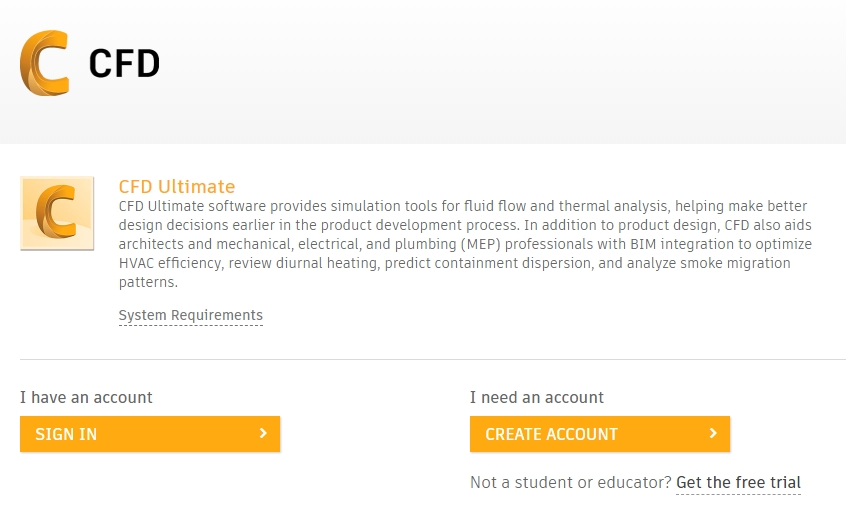
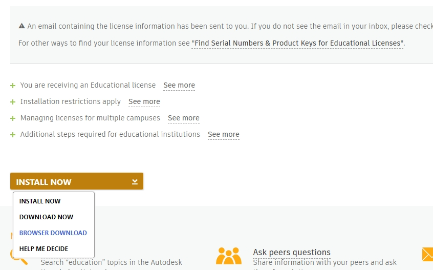

# Autodesk CFD 설치

 

> 1. 아래 링크로 들어간다.   
> https://www.autodesk.com/education/free-software/cfd-ultimate
>     
>     
>   
> 2. 대학생 프로모션 인증이 된 계정으로 로그인한다. (없다면 가입해서 즉시 인증할 수 있음)   
>   
> 3. Version, Operating system, Language 선택.   
>   
>     
>     
>   
> 4. **Serial number, Produck key를 기록해둔다.**   
>   
> 5. 다운로드 시작하기 전에 **방화벽 비활성화**   
>   
>     
>  
>   
> 6. **INSTALL NOW 누르지 말고 버튼 가장 오른쪽의 화살표 클릭**   
>   
> 7. BROWSER DOWNLOAD 선택   
>   
> 8. 이후 설치파일이 다운로드되고, 실행해서 Autodesk CFD를 설치한다.   
>   
> 9. 설치된 Autodesk CFD를 실행한다. 관리자 권한으로 실행할 것을 추천한다.   
>   
> 10. Serial number와 Product key를 요구하면 입력한다.   
>   
> 11. 입력했음에도 또 물어보는 경우가 있다. 당황하지 말고 다시 입력해주자.
>   
> 12. 성공적으로 실행했다면 방화벽 다시 활성화하는 것을 잊지 말자.

  
