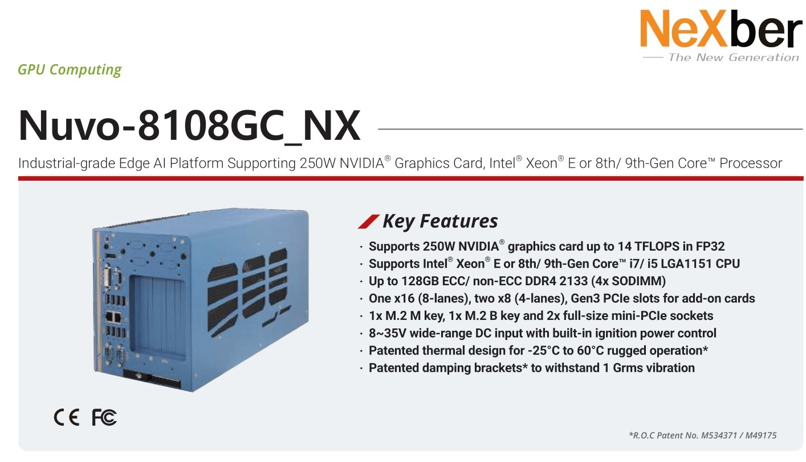
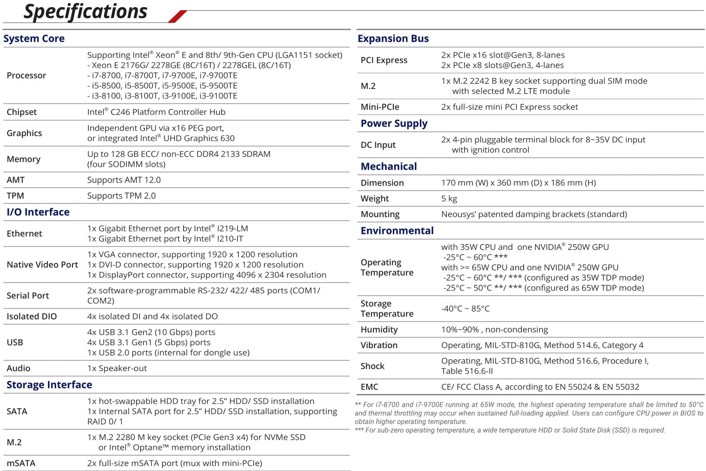
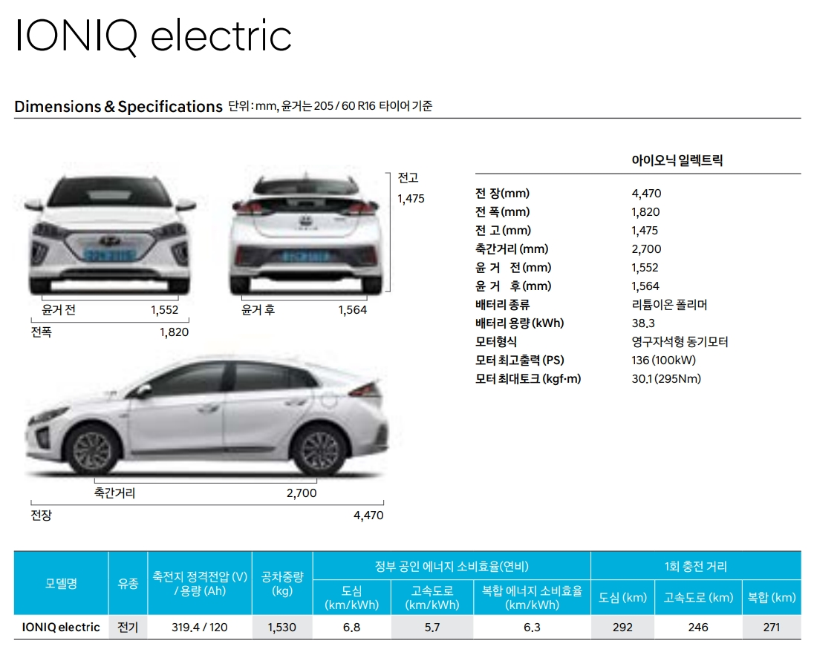
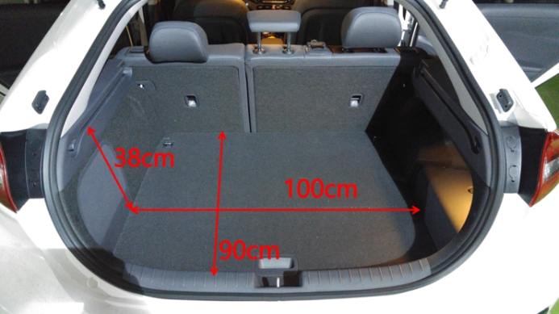
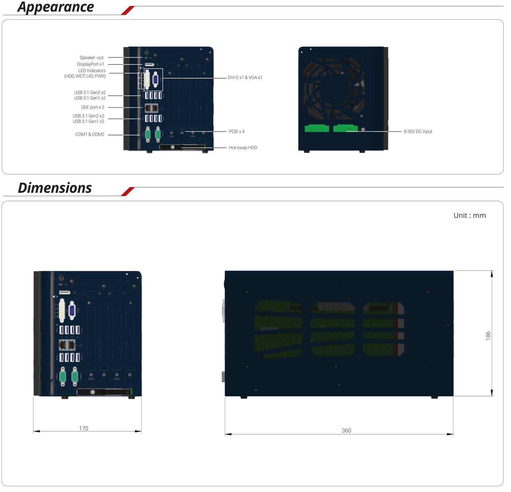
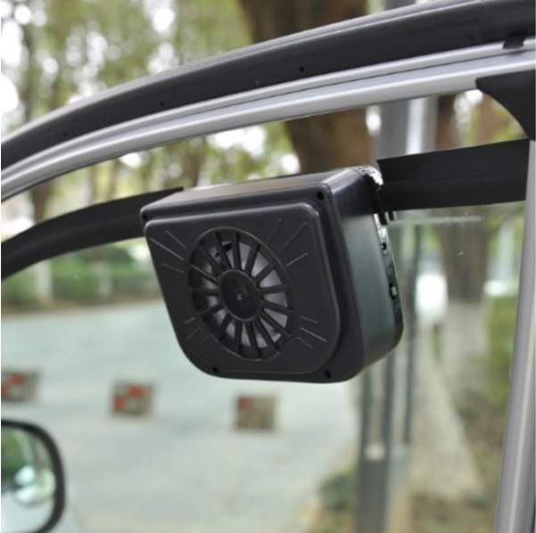

# 차량 내부 온도조절하기 part1
김찬영 / 2020. 03. 21

차량 내부에 고성능 PC가 들어가는 만큼 내부에서의 열 발생량 또한 무시할 수 없다.   
자율주행 하는 내내 계속 PC가 작동할거고 열이 발생할 텐데   
열 배출이 효과적이지 않으면 내부 온도가 계속 올라가서 PC 반응속도가 느려져 위험해질 수도 있다.   
그 정도까지는 아니어도 해치백이라 객실이랑 연결되어 있어서 무지 더워질수도 있다. ~~에어컨 틀라고?~~ ~~ㅇㄹㄸ~~

뭐 진짜로 에어컨을 틀어서 해결할 수도 있는데, 객실 온도에 구애받지 않고 PC 주변 환경만 제어할 수 있는 시스템이 있다면 더 효율적이지 않을까. 

## 열원과 계(系, Thermodynamics System)

### 1. 열원. 특수목적 차량용 IPC

자율주행에 필수적이자 전체 열원의 90%를 차지...할 것 같은 특수목적 차량용 IPC Nuvo-8108GC-NX.   
스펙은 아래와 같다.

   

규격에 관한 스펙도 있으나 이는 아래의 계(系)에서 다루겠다.

여기서 눈여겨보아야 하는 부분은 당연히 DC Input과 Operating Temperature 부분.   
우리는 이놈에게 24V의 전원을 입력할 예정이라는 것을 이미 알고 있다. 그러니 들어가는 전기는 해결.   

컴퓨터라는 것은 중간중간의 여러 소자를 거치면서 여러 연산과정을 거칠 뿐이지,
결국은 하나의 커다란 저항이라고 할 수 있다.
이를 각 부품이 소모하는 전력(W)을 통해 간접적으로 계산할 수 있다.

> 1. CPU: Intel Xeon Processor E-2176G (80W average)
> 2. GPU: GeForce RTX-2080Ti 11GB (260W)
> 3. SSD: 970 PRO NVMe 512GB MLC (5.2W, 8.5W at maximum)

이 외에도 전력을 잡아먹긴 하겠지만 그 존재감은 상대적으로 매우 작을 것이기 때문에 무시해도 될것이다.   
(만약 이외에도 고려해야 할 부품이 있거나, 위 정보에서 수정 필요하면 지적해주시길.)   
이로써 해당 컴퓨터는 대략 350W 내외의 전력을 잡아먹는다고 할 수 있겠다.   
근데 일반적으로 말하는 고성능 컴퓨터의 오버클럭을 600W 라고 말하던데...   
우선은 350-600W 라고 잡아서 시뮬 돌리고, 나중에 컴퓨터에 디지털검류계 달아서 확인해 봐야겠다.

여기서 전기에너지에 대한 ~~간단한~~ 복습을 해보자.

>    
> 

전기에너지 EE는 전압과 전류, 그리고 동작한 시간(sec)의 곱으로 표현된다.   
그리고 여러 전기 부품의 전력으로 표현되는 P는 입력 전압과 전류의 곱으로 표현된다.   
다시 말해서 전력에 동작한 시간(sec)를 곱해주면 기기가 일정 시간동안 사용하는 전기에너지의 양이 된다.   
우리의 컴퓨터는 열심히 머리만 굴리는 역할이므로, 이 전기에너지가 100% 열에너지로 바뀐다고 가정하는 것이다.   

기왕 계산하는거 전류도 계산하고 넘어가자. 
위 방법에서 우리는 입력 전원이 24V인 것을 알고 있다.   
전력이 350-600W 인게 사실이라면 이 컴퓨터에 흐르는 전류는 15-25A 이다.   
...직류라 그런지 엄청 높게 흐르네. ~~디지털검류계 달면 순식간에 터지려나~~   
아무튼 여기서 전류와 저항에 대한 줄(Jool)의 법칙을 사용하면 다음과 같다.

> 

그렇다. 전기에너지와 전력의 식으로 구하는 거랑 완전 똑같다.   
그냥 우리 컴퓨터에 흐르는 전류가 얼마인지도 말하고 싶어서 줄의 법칙도 언급한거다.   
아무튼 우리 컴퓨터가 1시간 동안 내는 열을 계산해보면 다음과 같다.

>    
>    
> 
> 

이게 얼마나 큰 양인지는 계(系)의 크기도 계산해봐야 알 것이다.

### 2. 계(系). 현대 아이오닉 일렉트릭

앞으로 얼마나 오랫동안 써야 할지 모를 우리의 자동차.

아이오닉 일렉트릭은 해치백이라 객실과 트렁크가 연결되어있다.   
따라서 아무것도 건드리지 않는다면 차량 내부 전체가 계가 될 것이다.   
물론 그보다는 IPC만의 공간을 만들어서 따로 열관리를 하는 것이 훨씬 효율적일 것이다.   
감사하게도 어느 다른 분께서 블로그에 아이오닉의 트렁크 크기를 측정해서 올려주셨다.

> 출처: https://blog.naver.com/clauds/220673115378

이제 여기에 이 정도 크기의 IPC를 배치될 예정이다.

앞서 계산한 열원의 열 발생량은 300-514 kcal이다.   
이 계에서 온도가 얼마나 빠르게 증가될지 예상해보자.   
트렁크를 위 사진에서 보여진 수치의 직육면체 크기의 공간이라고 가정하자. (당연히 이거보단 크다!)   
약 0.34 m^3 의 공간이 나온다.   
그렇다면 이 공간의 열용량은?

> 공기의 비열 : 0.24 kcal/kgCº   
> 공기의 질량 : 1.2 kg/m^3   
> 트렁크 공간 내부의 질량 : 0.41 kg   
> 트렁크 공간 내부의 열용량 : 0.0984 kcal/Cº   
> IPC가 1시간 작동하는 동안 트렁크 공간 내부의 온도 변화 : 3049-5224 Cº ~~꺄악~~

물론... 이거보단 당연히 온도변화가 적을 것이다.   
트렁크의 공간을 실제보다 작게 근사하기도 했고,   
우리의 차량은 고립계가 아니고,   
무엇보다 차량 내부의 표면도 엄연한 열용량이 존재한다.

그러나 공간이 더 커봤자 3~4배 밖에 안될 것이고,   
고립계는 아니다 하더라도 창문을 제외한 대부분은 단열재이고,   
차량 내부의 표면은 그 온도가 충분히 올라가고 나서는 열평형 상태에 도달할 것이다...   
그리고 IPC의 허용 온도는 60 Cº 이다. ~~IPC:죽...여..줘...~~   
내가 잘못 계산한게 아니라면 저것의 열을 뺄 수단이 하나쯤은 반드시 필요할 것으로 보인다.

예를 들면... 이런거?

트렁크에서 IPC 주변 공간만 별도로 밀폐시킨 후 이거랑 연결해서 항시 작동하게 한다던가...
뭐 어쨌거나 하나 확실한 것은 적어도 한 번쯤은 시뮬레이션이 필요하다는 것이다.   

정말 다행인 것은, 어제 AutoDesk의 유체 시뮬 프로그램 CFD를 성공적으로 설치했다.   
그동안 자꾸 안되는 이유는, AutoDesk가 CFD에 학생 라이센스를 넣는 것을 깜빡한거 같다는 것이다. ~~무엇;~~   
사실 메인 이슈는 아니라서 다른 사람들도 이걸 설치해서 사용법을 익힐 필요까지는 없을 것 같고   
기왕 CFD 설치한거 내가 열 관리를 아예 전담하는 게 나을 것 같다.   
그래도 해보고 싶은 사람이 있다면 다음 파트에서 CFD 시뮬레이션하는 내용 올리면서 설치법도 같이 올리겠다.
