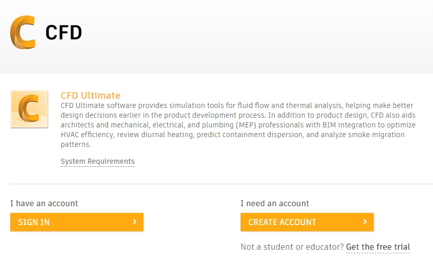
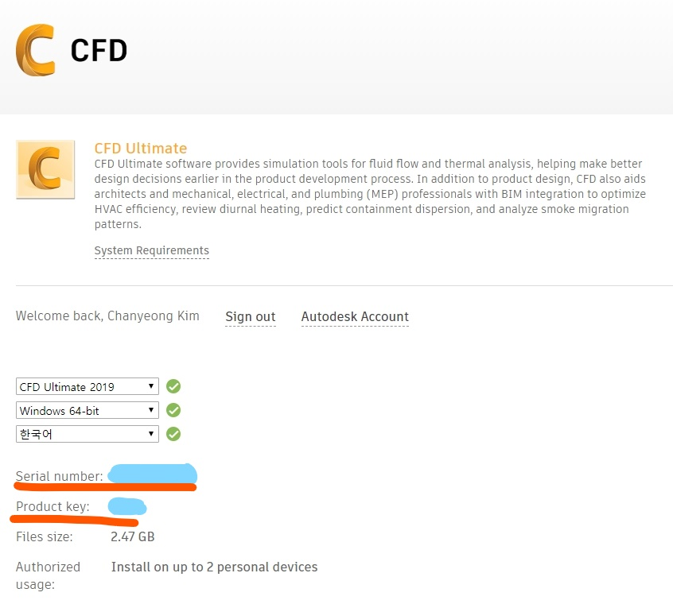

# 차량 내부 온도조절하기 part2 (+CFD설치)
김찬영 / 2020. 03. 21

[차량 내부 온도조절하기 part1](./thermal_control_part1.md)

지난 파트에서 아이오닉 트렁크가 고립계라는 가정하에 IPC를 한 시간동안 작동시키면   
주변 공기가 **3000ºC** 라는 ~~정신나간~~ 온도가 된다는 결과를 얻었다.   
그러나 이는 매우 근사된 계산이기에 더 합당한(?) 예상 결과를 보아야 하고,   
가능한 효율적이면서 효과가 좋은 온도조절 방법을 찾아야 한다.   

그래서 사용하는 것이 유체 시뮬레이션이며,   
Solidworks의 flow simulation 애드온을 사용할 수도 있지만   
현재 Autodesk사의 Inventor를 사용하고 있으므로 동일사의 유체 시뮬레이터인 CFD를 사용한다.

설치 링크는 아래에 있으며, Inventor와 동일하게 대학생 프로모션으로 무료 사용이 가능하다.   
https://www.autodesk.com/education/free-software/cfd-ultimate

**단, 그냥 설치하다간 ~~나처럼~~ 뭐가 문제인지도 모르고 빙글빙글 돌기 마련이니 아래 방법에 따라 설치하자.**

## Autodesk CFD 설치
 
> 1. 위에 올린 링크로 들어간다.   
>   
>     
>     
>   
> 2. 대학생 프로모션 인증이 된 계정으로 로그인한다. (없다면 가입해서 즉시 인증할 수 있음)   
>   
> 3. Version, Operating system, Language 선택.   
>   
>     
>     
>   
> 4. **Serial number, Produck key를 기록해둔다.**   
>   
> 5. 다운로드 시작하기 전에 **방화벽 비활성화**   
>   
>     
>  
>   
> 6. **INSTALL NOW 누르지 말고 버튼 가장 오른쪽의 화살표 클릭**   
>   
> 7. BROWSER DOWNLOAD 선택   
>   
> 8. 이후 설치파일이 다운로드되고, 실행해서 Autodesk CFD를 설치한다.   
>   
> 9. 설치된 Autodesk CFD를 실행한다. 관리자 권한으로 실행할 것을 추천한다.   
>   
> 10. Serial number와 Product key를 요구하면 입력한다.   
>   
> 11. 입력했음에도 또 물어보는 경우가 있다. 당황하지 말고 다시 입력해주자.
>   
> 12. 성공적으로 실행했다면 방화벽 다시 활성화하는 것을 잊지 말자.
