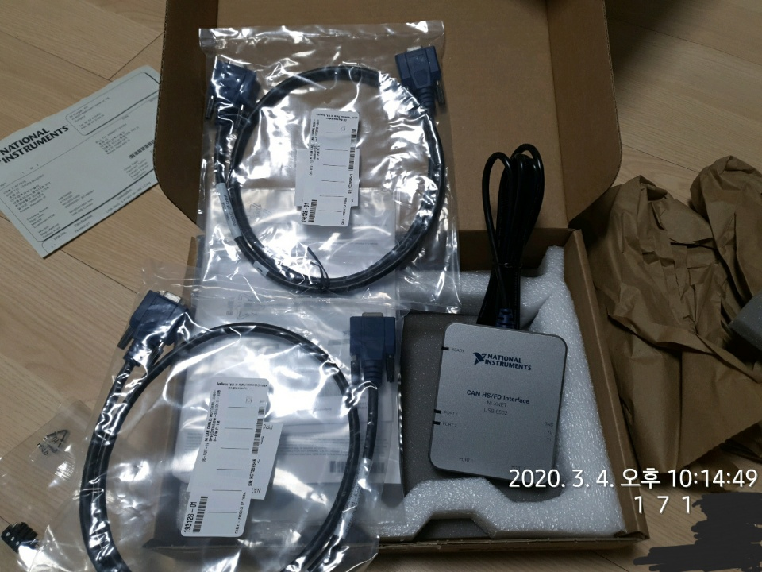

# 차량과 컴퓨터를 연결해보자! part1
여호영 / 2020.03.04

## Hardware
#### 차량 내 케이블
CAN 통신을 이용해서 차량에서 컴퓨터로 데이터를 가져오기 위해선 어떤 디바이스와 케이블이 필요한지 알아보았다.    
우리가 받은 베뉴 차량에 OBD2 케이블이 있는 것을 확인했다. 총 OBD2 케이블은 총 두 개로 하나는 FUSE 박스에 있고, 하나는 선으로 연결돼서 밖으로 나와있다.    
아마 따로 선으로 하나 나와있는 것은 현대 측에서 연구하기 편하라고 만들어준 것이지 않았을까 싶다.
그러면 OBD2 케이블을 USB로 연결할 방법을 찾아야겠지?

#### 구매한 케이블
차량과 컴퓨터를 연결하는 케이블을 구할때 National Instrument korea사의 도움을 많이 받았다. ~~National Geographic이 아닌^^~~    
CAN 통신과 관련된 hardware, software(data 수신, simulation 등)를 이해하기 위해서 도움이 될 것이다.    
(참고 : [NI YOUTUBE](https://www.youtube.com/watch?v=B4iKB7Tx6b4&list=PLFEQP5FItT4NTB1eiAKeYteb6DPJC43fQ, "youtube link"))
특히 하드웨어 팀은 꼭 보도록...    
하여튼 알아본 결과 OBD2-9Pin(CAN) 케이블과 9Pin-9Pin(CAN) 케이블 그리고 마지막으로 CAN 컨트롤러(USB 포트가 있음)가 필요하다.    
그림으로 그리면 다음과 같다. (못그렸지만 이해 좀...ㅎ)    
    
[Embedded system korea](http://www.eskorea-shop.kr/, "es-korea") 사이트에서 모든 케이블을 구매했다. (CAN controller 포함 - Kvaser사)    
위 그림에서 가운데에 9Pin-9Pin 케이블이 필요한 이유는 양 쪽이 전부 male이기 때문이다.    
구매는 사이트에서 키워드만 입력하면 되니 만약에 필요하면 참고하면 될 듯하다.

## 물품 도착
오늘(2020.03.04) CAN 통신을 테스트할 물품은 다 도착했다.    
   
위에 내가 잘(?)그린 그림이랑 비교해보면 어떤 사진이 어떤 물품인지 알 수 있을 것이다.    
물품이 다 도착했으니 물품을 다 들고 차량에 가서 테스트 해보는 시간을 가졌다.

## 첫 번째 테스트
차량에 도착해서 아래와 같이 차량과 컴퓨터를 연결했다.    
    
차량과 OBD2-9pin 케이블을 연결하고    
    
OBD2-9pin케이블과 9pin-9pin 케이블 연결하고 그것을 컴퓨터에 연결한 CAN controller와 연결했다.    
    
다 놓고 보니 그럴싸하다.    
컴퓨터가 CAN controller를 인식할 수 있게 드라이버를 설치하고 CAN 데이터를 받아오는 software를 설치했다.    
이제 테스트 해볼 시간이다.

## 첫 번째 문제
테스트를 해보려고 CAN controller의 software에서 CAN 데이터를 받아오려고 했지만 아무 반응이 없다...    
케이블을 다른 곳에 꼽기도 해보고 컴퓨터를 껐다가 켜보기도 하고 Baud rate(500kbit/s)도 수정했지만 똑같은 상황이 반복됐다.    
그래서 데이터 시트나 구글링을 해서 알아본 결과 우리가 산 CAN controller와 케이블에는 120Ohm의 저항이 없다고 한다.
여기서 120Ohm의 저항은 CAN 신호를 받아올 때 필수적인 요소이다.    
결국 해산하고 120Ohm이 들어있는 9pin 커넥터를 사서 다시 한 번 테스트 하기로 했다.    
바로 아래 그림처럼 커넥터를 추가할 것이다.    

