# 차량과 컴퓨터를 연결해보자! part2
여호영 / ~2020.04.17

## 지난 번 이야기
CAN 통신에 필요한 CAN Interface와 케이블 구매 후 차량과 컴퓨터를 연결해보았다.    
하지만 놀랍게도 아무 반응이 없었다!    
여러 판매처에 문의 결과 Baud rate 수정, 종단 저항 측정 등 시도해보라는 답변을 받았고 이 또한 문제가 아니었다.    
과연 무엇이 문제일까?

## National Instrument Korea 사의 도움
CAN Interface를 구매한 National Instrument(NI)사에 기술 문의를 하였다.    
이 문의는 거의 2주일이 되도록 진행되었다.    
처음으로 답변을 받았던 것이 기기 자체에 결함이 있는지 확인해보라는 것이었다.

#### 기기결함    
기기 자체에 결함이 있는지 확인하는 방법은 CAN Interface에 있는 2개의 포트를 한 선으로 연결한 후에 Labview 내의 예제를 통해서 Loop-back 테스트를 하는 것이다.    
테스트 모습은 다음과 같다.    
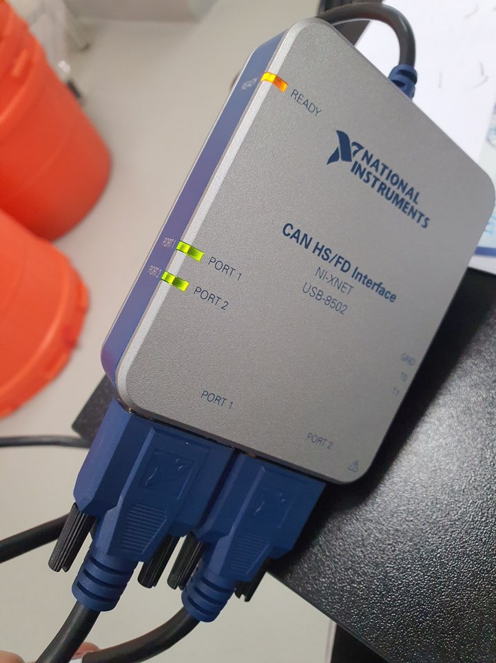</img>  
[사진1] USB8502의 모습    

두 RS232 포트를 한 케이블로 연결하고  
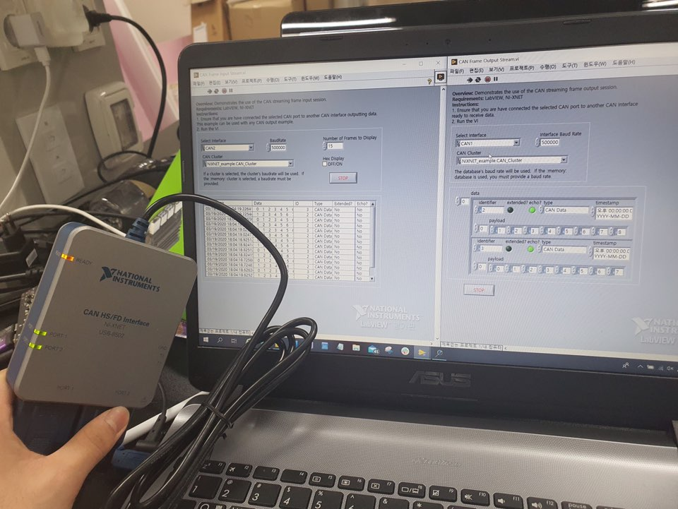</img>  
[사진2] Loop-back 테스트를 진행하는 모습    

Labview 내의 예제를 실행해본다. --> 정상적으로 결과값이 나오며 기기 자체에는 결함이 없는 것으로 확인됨!

#### Cable Pinmap 확인
두 번째 답변은 우리가 사용하는 기기들의 Pinmap을 확인해보라는 것이었다.    
구글 검색 및 쇼핑몰에서의 기기들의 Pinmap을 확인해보았다.    
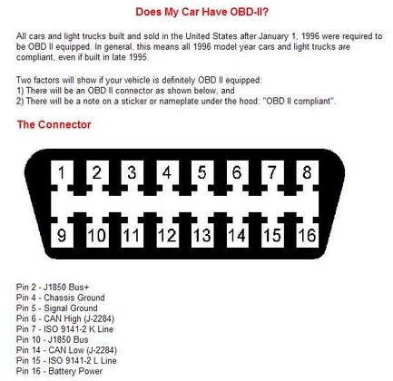    
[그림1] 현대 OBD 단자    

우선 현대 차량의 OBD 단자의 pinmap이다.    
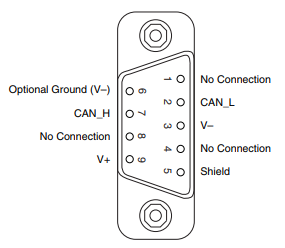   
[그림2] CAN Interface(USB8502) pinmap    

그리고 CAN Interface인 USB8502의 pinmap이다.    
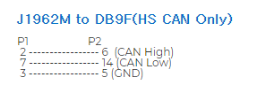    
[그림3] OBD-RS232 케이블 pinmap    

마지막으로 위 두 장치를 이어주는 OBD-RS232 케이블의 핀 구성이다. (여기서 큰 실수를 한다.)    
다음과 같은 포트를 연결해주는 구성이면 된다.    
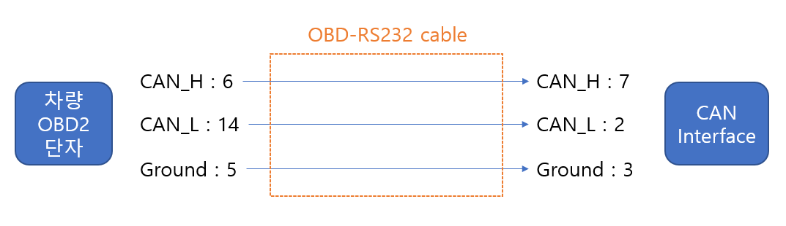    
[그림4]    

정리를 해보면 [그림 1]에서 CAN_High에 해당하는 6번 포트가 [그림 2]에서 CAN_High인 7번 포트에 연결되고,    
[그림 1]에서 14번 포트가 [그림 2]에서 2번 포트와 연결되어야 한다.    
그런데 [그림3]을 보면 CAN_H, CAN_L가 서로 바뀌어 있는 것을 알 수 있다.   
그래서 필요에 따라 배선을 바꾸어 줘야한다.

#### 배선 변경
즉시 케이블 배선을 변경하는 작업을 진행했다.    

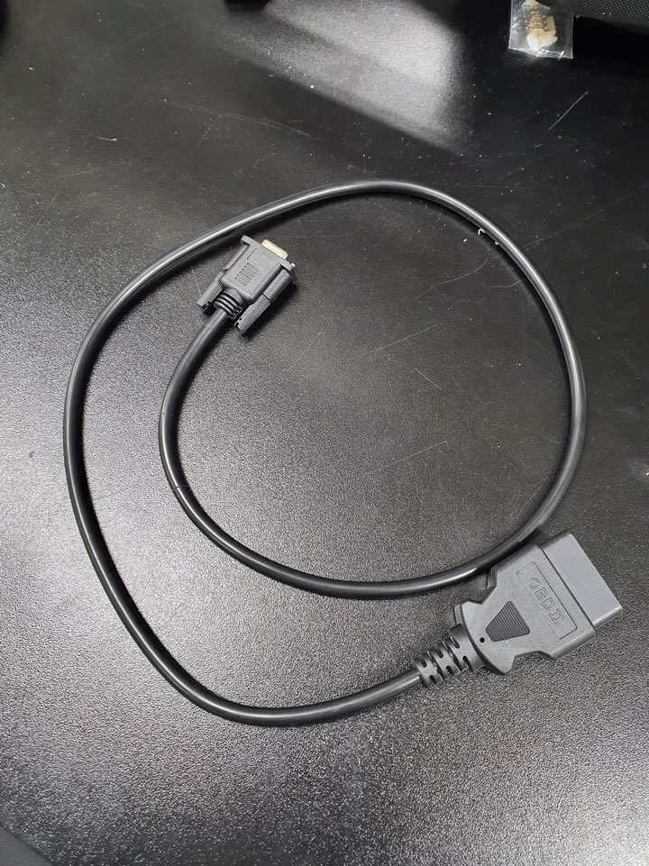</img>  
[사진3] OBD-RS232 케이블    

먼저 OBD-RS232 케이블을 준비한다.    

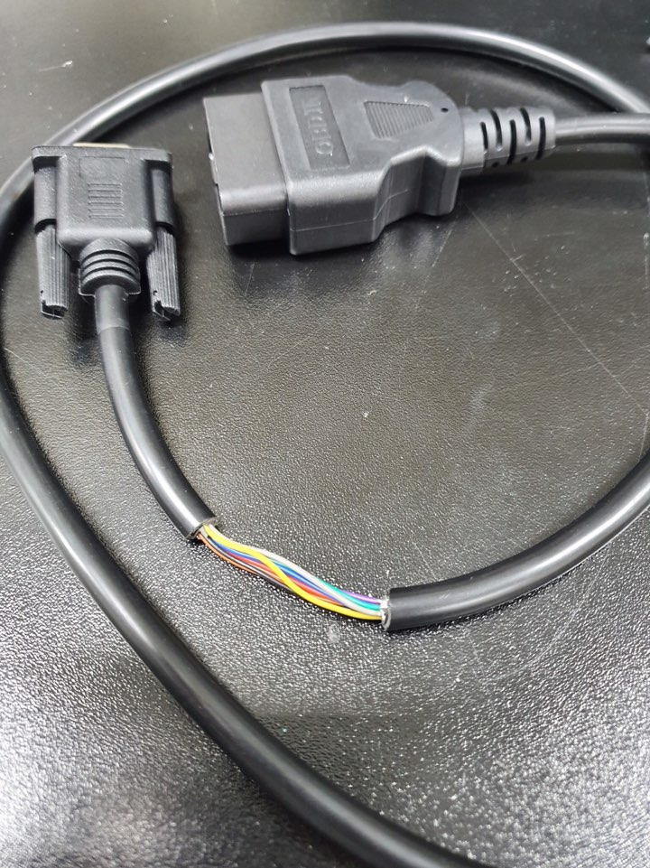</img>  
[사진4] 과정 1    

케이블의 배(?)를 따서    

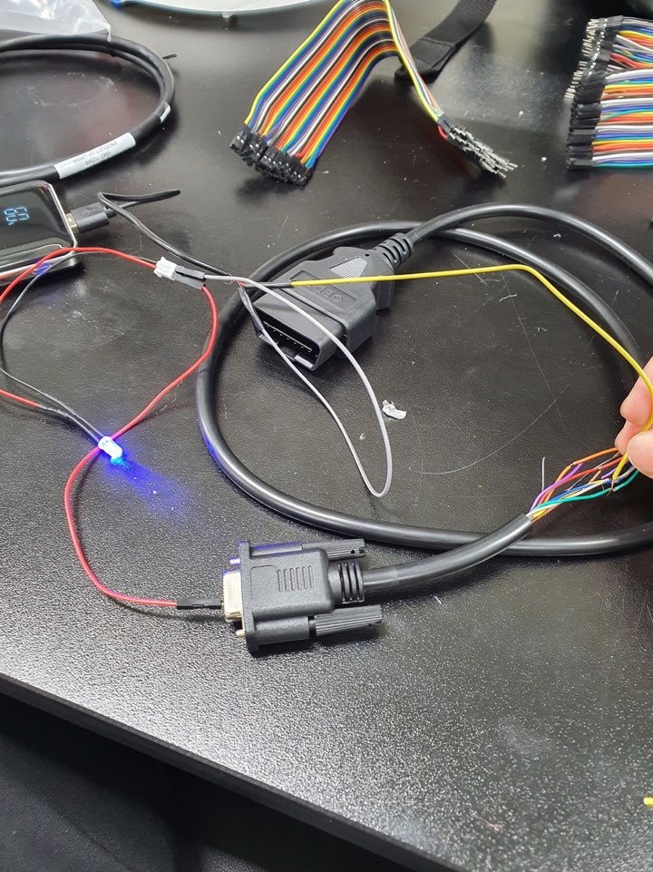</img>  
[사진5] 과정 2    

나만의 테스터기를 만들어 각각의 선이 케이블의 몇번에 해당하는지 파악한다.

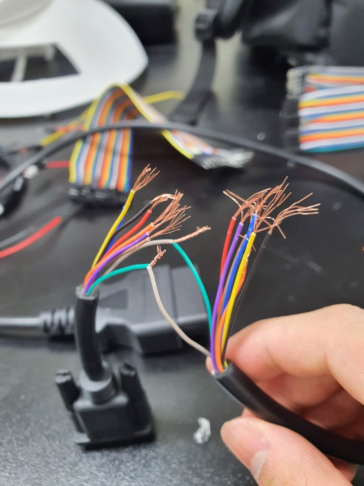</img>  
[사진6] 과정 3

CAN_H인 2번 핀과 CAN_L인 7번 핀을 교차해 연결한다.

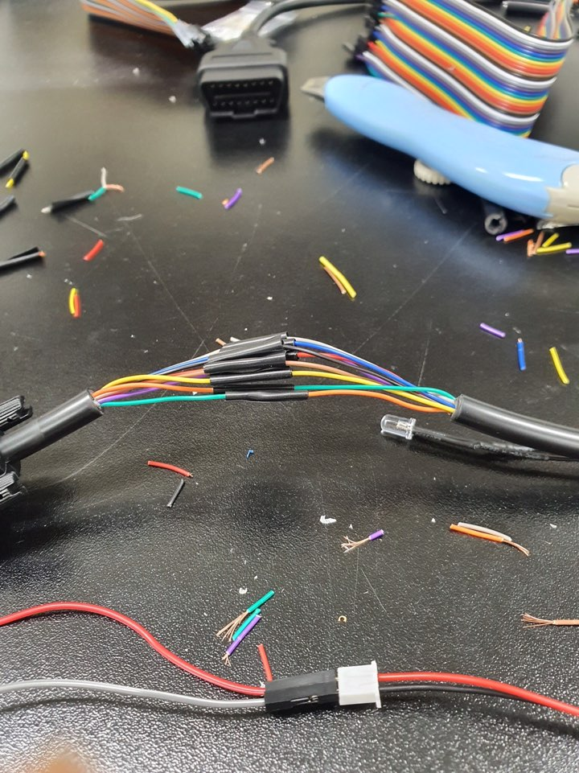</img>  
[사진7] 과정 4

나머지 선을 원래대로 연결한다.

</img>  
[사진8] 과정 5    

모든 선이 합선이 되지 않도록 마감한다.    
이제 될 것이라는 기대를 가지고 차에 가서 테스트를 해보았다.    
결론 : 안 된다. 다시 판매처에 문의를 해야겠다.
