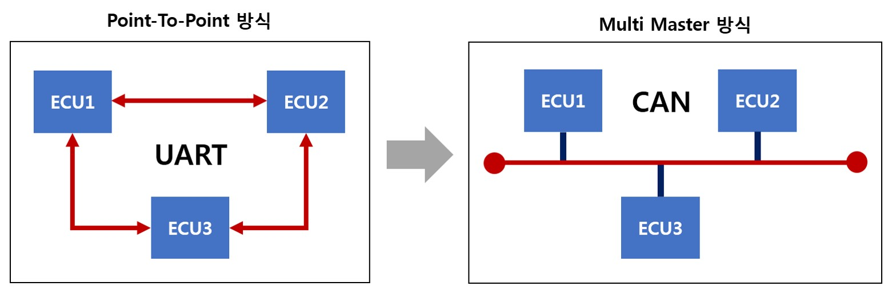

# CAN 통신으로 차량 제어하기 part1
신관준 / 2020.02.19

## CAN 이란

CAN 통신은 통신 규격의 일종으로 자동차뿐만 아니라 다양한 기계에서 사용되고 있다.    
Master-Slave관계로 이루어진 통신 시스템인데. 재밌는 구조이다.    

   
통신을 라우팅하고 중계하는 장치 없이 자동차의 각 장비가 하나의 CAN 회선에 연결되어 정보를 전달하는건데.  
위 그림을 보면 잘 생각하면 아래와 같이 생각할 수 있다.

1. 하나 ECU 단자에 데이터를 뽑아도 전체 CAN의 정보가 뽑힌다. (Sniffing)
2. ECU 노릇을 하는 외부 장비를 달고서 값을 보낼 수 있다. (Injection)

그래서 CAN 통신 해킹이라는 말이 관련 강좌명으로 많이 쓰이는 것을 볼 수있다.
여튼 우리 자율차에 CAN 통신을 이용해서 제어나 알고리즘 설계에 도움이 될 수 있고자 한다.   
그런데 단순 차량의 엔진과 액츄에이터의 제어 말고도 에어컨/라이트 등 다양한 Chasis ECU를 제어할 수 있는 것이다. 차 타기전에 온열시트를 킨다던가... 여튼
자동차 옵션 추가로 할 수 있는 일들을 ~~쉽게~~ 개발할 수 있는 것 같은 생각...이 든다

## CAN 종류와 포트

자동차에는 다양한 통신 프로토콜이 쓰인다는데, 데이터의 속도와 한번에 많은 양을 전송할 수 있는 HighSpeed CAN, 단순 자동차의 샤시간 정보를 관할하는 LowSpeed CAN이 있다.   
또한 사이드 카메라, 후방 카메라는 LIN 이라는 것을 쓴다.

> ??? : 그래서 뭘 써야되는데;;

대부분 자율차를 하시는 분들이라면 속도 같은 자동차 계기간의 데이터 수집으 HighSpeed CAN을 이용한다. 우리도 그럴꺼고.  

CAN 포트는 D-SUB 9 Pin 을 이용하면 대부분 사용되는데, 이게 9Pin이 다 필요한 것이 아니라 CAN_H, CAN_L 이 필요하다. 우리 아두이노 만진 친구들이라면 잘 알듯이 PWM 처럼
펄스 신호를 보내는 방식이다.

> 자동차의 D-SUB이 있나요?? 

처음에 CAN 통신이라는 말만 알고 자동차의 뭐 CS포트 관리 포트처럼 뭔가 나와있는줄 알았는데, 없더라 오직 OBD2 단자만 있는데 현대 GSW 사이트에서 핀맵을 봐도되고,     OBD2는 표준규격이라 핀맵이 검색마 해도 나온다. 여튼 거기에도 CAN_H와 CAN_L이 있다. 위에서 말했듯이 CAN은 구조상 한 곳에서만 접속해도 모든 정보를 알 수 있다. 그 핀에 접속하며 된다.

D-SUB와 OBD2 간 변환잭도 있으니 사도 되고 혹은 그냥 핀맵을 보고 빼서 넣어도 된다.

우리는 유지보수 이유도 있으니, 관련 잭을 구매목록에 넣어놨다.

그리고 단순히 포트가 닮았다고 생각해서 시리얼 통신 처럼 컴퓨터에 꽂으며 뭔가 나오겠지 하는분이 있을 수 있지만 그렇지는 않고 CAN 관련 트랜시버 칩이 있어야한다.   
__즉 추가적으로 CAN 2 usb or D-Sub CAN to usb 제품을 사야한다__ 우리는 이 쪽으로는 유명한 Kvaser Leaf Light _(업체 관계자의 발음은 크베이저)_ 를 구매목록에 올려놓고 있다.

결국 우리의 최종 구매는
   1. National Instrument / CAN USB8502
   2. Kvaser / Leaf Light CH1
   3. OBD2-RS232 Cable
   4. RS232-USB Cable
이고 약 200만원정도 나온다.

## what CAN can do?
우서 우리 통신 파트의 목표는
> __목표 :  우리 자율차에 CAN 통신을 이용해서 제어나 알고리즘 설계에 도움이 될 수 있고자 한다.__   
자율주행차량의 CAN DB 구축 및 ROS기반 차량 제어/계측 라이브러리 개발

   ㅇ 자율주행기술 개발시 차량 장비 활용 가능   
   ㅇ 일반 차량의 자율주행화 기술의 기반 기술로 활용 가능   
   ㅇ 디버깅이 불가한 외부업체 VCU와 별도로 차량 계측 장비 구축으로 정보 신뢰성 향상   
   ㅇ 고수준의 운전자-차량 상호 소통 가능   
      1. 운전자가 핸들이나, 패들에 조작을 가할 경우 자율주행 모드 비활성화   
      2. 운전자가 핸들의 멀티펑션 스위치를 통해 방향지시등을 넣을 경우 자율주행 SW에서 자동으로 차선 변경 진행   
      3. 차량 내 위험상황 발생시 2차 사고 방지를 위한, 비상등 자동 작동 및 창문 전개등 다양한 바리에이션 가능   
      4. 최종적으로 컴퓨터와 자동차간의 고수준의 상호통신 가능   

### PART2에서는 아이오닉 차량과 CAN을 연결해보고 테스트해보자.
그전까지 이미 누군가 아이오닉 CAN PID를 공개했다. 정말 멋있다. [Github](https://github.com/JejuSoul/OBD-PIDs-for-HKMC-EVs/tree/master/Ioniq%20HEV) 참고하기
