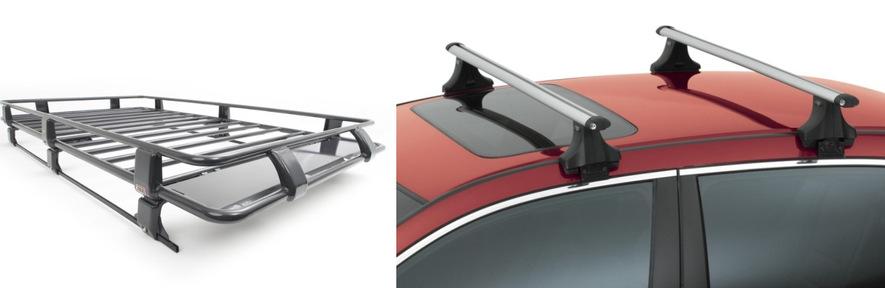

# 차에 막 구멍 뚫어도되요?
> A. 아니요? ~~돌았나~~

아쉽게도 차에 막 구멍을 뚫으면 안된다. 이것을 공부하면서 전국 각지의 정비사분들을 존경하게 되었다.   
__의외로 깨달았던 것은__
> 1. 구멍을 뚫지 않아도, 차량 내부는 구멍이 있어서 다 연결되어있음 (트렁크-좌석, 엔진룸-실내 등..)
> 2. 우리 연구팀은 현대차를 개조하는데 현대차 GSW 라는 사이트에서 배선과 뚫고 말고를 알 수 있음.
> 3. 사설 네비게이션 매설로 강해지는 한국 유튜버들의 자료가 방대함.

### Step 1. 차 위에 센서를 거치해야된다. 구멍을 뚫을까?
보통 자율차를 생각하면 아래 같은 사진을 생각하는데, 요 위에 튀어나온 라이다와 아래 카메라를 보관하는 센서팩을 볼 수 있다.   
심미성도 있고 센서를 보호할 수 있어서 일석이조이다.

기본적으로 스키 캐리어, 혹은 루프 캐리어, 스키 랙으로 유명한 Thule사의 장비를 찾아보기 시작하면 ~~사라는게 아니다~~   
이를 설치하는 과정이 중요하다.

