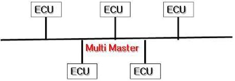

# CAN 통신이란 무엇인가? part2
여호영 / 2020.02.26

## CAN
CAN 통신은 Controller Area Network의 줄임말로 차량 내에서 호스트 컴퓨터 없이 micro controller나 장치들이 서로 통신하기 위해 설계된 표준 통신 규격이다. CAN 통신은 각 제어기들 간의 통신을 위해 주로 사용되는 non-host bus 방식의 메세지 기반 Network protocol이다.
CAN 통신의 일반적인 특징을 알아보자.

#### CAN 통신의 특징
- 여러 개의 ECU를 병렬로 연결해 데이터를 주고받는 통신 방법.
- Micro Controller 간의 통신을 위해 설계된 Serial Network 통신 방식으로 여러 개의 CAN 장치가 서로 통신할 수 있는 경제적이며 안정적인 네트워크.
- 하나의 CAN 인터페이스로 여러 개의 ECU를 제어함으로써 자동차의 전체 Cost와 중량을 줄일 수 있고 시스템 제어 속도와 안정성을 향상시킬 수 있음.
- 장치마다 CAN controller 칩이 있음 --> 효율적으로 각 시스템 제어 가능.
- Multi Master 통신 : 모두가 Master이므로 원할 때 사용 가능.
- 전선의 길이가 짧음.
- Plug&Play : 간편하게 CAN Controller를 버스에 연결하고 끊을 수 있음.
- 한 곳으로 여러 명령이 들어오면 우선 순위에 따라 작동함.
- 주소가 아닌 ID에 의해 메시지의 내용과 우선 순위가 결정됨.
- ECU 분산제어 적용 가능.
- 설정된 ID만 골라 수신 가능.
- 다른 통신에 비해 장거리 통신 가능. (약 1km)
- 모든 노드는 공통 Baud rate를 사용. (이 내용은 아래에서 자세히 다뤄보자.)

위의 내용처럼 CAN 통신은 차량과 같이 복잡한 시스템으로 구성된 하드웨어에서 사용되는 네트워크이며, 그 복잡한 디바이스 사이에서 경제적이며 안정적인 통신을 위한 것이라고 생각할 수 있다. CAN은 1983년 최초로 Bosch 사에서 개발되었고 이후 1991년에 CAN 2.0 스펙이 발표되었다.
CAN 2.0의 스펙은 다음과 같다.

#### CAN 2.0의 특징
- 적용 분야 : 제어시스템(파워트레인), 고장진단
- 전달 매체 : 2선식(Twist pair cable)
- Access 방식 : 이벤트 방식(멀티 마스터)
- ID 길이 : 11bit(CAN 2.0 A), 29bit(CAN 2.0 B)
- 데이터 길이 : 0~8byte
- 최대 전송 속도 : CAN A(고속, 500k~1Mbps), CAN B(저속, 125kbps 내외)
- 최대 Bus 길이 : 특정한 길이로 정해지진 않았지만 평균적으로 40m
- 최대 노드 수 : 이 또한 정해지진 않았지만 평균 3개

CAN 2.0은 다음과 같은 특징을 가지고 있다. 이전 CAN을 이용해본 적이 없어서 CAN 2.0의 장점이 무엇인지는 솔직히 잘 모르겠다..?
이번엔 위에서 CAN을 설명할 때 Baud rate라는 것을 언급했는데 그것이 무엇인지 알아보자.

#### Baud rate
한글로는 간단히 보레이트라고도 한다. Baud rate는 Micro Controller에서 데이터 통신 속도를 나타내는 단위로써 1초간에 전송할 수 있는 정보의 bit수로 표시한다. 다르게 말해서 1초에 얼마나 변조할 수 있는가를 나타내는 단위이다.
- Ex) 1600 baud rate : 8bit 단위로 데이터를 전송한다면 200개의 1byte 묶음으로 1초만에 전송. (8bit = 1byte)
- Ex) 1회 변조로 8byte 전송 : 1,000 baud rate = 8,000bps

이때까지 CAN 통신과 관련된 기본적인 것들을 알아보았다. 이번엔 마지막으로 CAN 통신의 프로토콜에 관한 내용으로 part2를 마무리 지어보고자 한다.

## CAN 프로토콜 구조
#### CAN 통신 매체
Twist Pair Wire로서 각각의 끝에는 120옴의 저항이 연결되어 있음. 각각의 선에는 서로 다른 반전된 신호를 사용하며 수신기에는 2개의 신호를 합하여 복원한다.
#### Twist Pair Wire의 특성
전자파가 Twist Pair Wire에 부딪히면 2개 bus 선은 동일한 영향을 받게 된다. 이때 CAN_H, CAN_L의 차에 의해 EMI(전자파)에 영향을 받지 않는 Differential Signal을 구한다.

## CAN 프로토콜의 작동 원리
- CAN Bus에 접근할 때 전체 노드를 제어하는 master가 없음.
- 각 노드에서 데이터를 전송할 준비가 되면 먼저 전송 준비가 되었는지를 bus에 확인함.
- CAN 프레임을 네트워크에 전송 : CAN 프레임은 전송이나 수신 노드 중 어느 노드의 주소도 포함하지 않는다. 대신에 고유한 ID를 통해 프레임을 분류하여 인식하게 된다.
- 각 노드들이 동시에 메시지를 CAN bus로 전송하려고 하는 경우 최우선 순위를 가진 노드(가장 낮은 중재 ID)가 자동적으로 버스에 access됨.

## 데이터를 Access하는 과정
- CAN bus 선이 사용 중인지 확인.
- 사용 중이지 않다면, CAN 네트워크 상의 모든 노드(ECU)는 메시지를 수신하여 자신에게 필요한 메시지인지를 식별자를 통해 확인.
- 필요한 메시지이면 데이터 분석을 진행하고, 불필요한 메시지는 무시함.
- 여러 노드의 데이터가 동시에 유입될 경우, 식별자의 숫자를 비교해 우선순위를 정함.(식별자의 숫자가 낮은 경우 우선순위가 높음.)
- 각각의 CAN 메시지는 11bit의 식별자(CAN 2.0A) 또는 29bit의 식별자(CAN 2.0B)를 가지며, CAN 메시지의 맨 처음 시작 부분에 위치.
- CAN 프레임의 ID는 메시지의 내용을 식별시켜주는 역할과 메시지의 우선순위를 부여하는 역할.
- 각 노드로부터 출력되는 데이터 메시지는 송신측이나 수신측의 주소를 가지고 있지 않음. 대신에 각 노드를 식별할 수 있도록 각 노드마다 고유한 식별자를 소유함.

지금까지 CAN 통신의 기본적인 것들과 프로토콜에 대해서 알아보았다. 우리에겐 익숙치 않은 통신 방식이어서 어려울 수 있겠지만, 너무 깊게 이해하지 않아도 된다. 우리는 그저 데이터를 분석할 수 있을 정도로만 알고 있으면 되니 너무 부담을 가지지 않아도 괜찮다.
다음 시간에는 CAN의 메시지가 어떤 정보를 가지고 있는지 알아볼 것이다.
