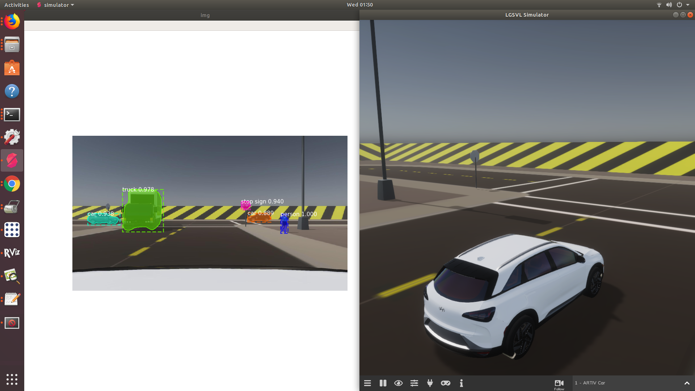
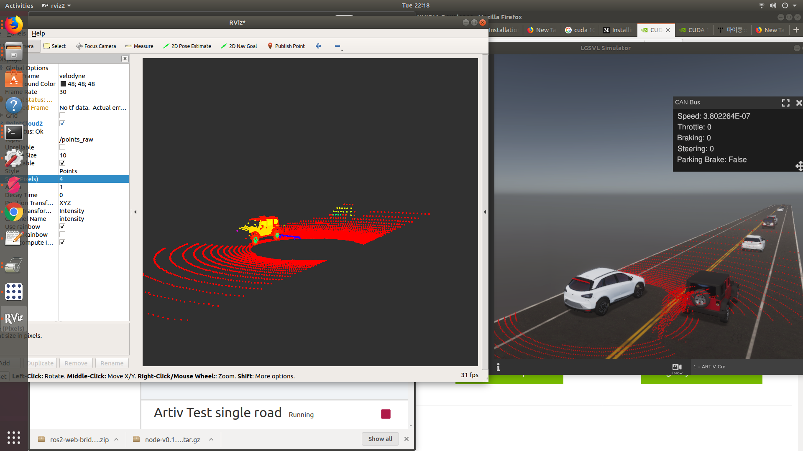

# 통합소프트웨어 연구개발 파트
모든 센서와 UI/UX를 개발하면 이를 한번에 멋있게 보여줄 SW가 필요하다. 동시에 각 센서의 값을 Real-time으로 분배해줄 방법도 찾아야한다.
이 일을 우리 파트에서 진행한다.

## ROS와 ROS2
이런 작업에서 대표적인 middleware라고 하면 당연히 ROS(Robot Operating System)이다. Linux기반에서 동작하는 우리 차에 ROS를 탑재하고 각 센서, 차량 액츄에이터, CAN을 PC와 연결 
하는 Bridge를 설계해서 적절한 Topic으로 사용할 수 있게 만들어주면 끝이다. 이 과정에서 전처리나 배포 방식을 각 개발팀과 상의해야하는 유연성도 필요하다.

그런데 문제는 ROS1과 ROS2가 있다면 우선 우리 연구는 딥러닝 관련 도입을 빠르게 처리하기 위하여 딥러닝 파트는 Python이 기타 부분은 C++로 작성할려고 하였다.
요즘 Tensorflow나 Keras같은 프레임워크들은 Python3를 지원하는데 ROS1은 엄청난 자료와 오픈소스 파일들이 많음에도 불구하고 Python2만 뚝심있게 지원한다.
과거에 ROS1에서 Python3를 동작할 수 있게 만들려고 엄청난 시간을 소모했지만 좋은 결과는 나오지 않았다. 그래서 ROS2는 필수적이게 되었다.

근데 ROS1와 ROS2를 굳이 비교하자면

||ROS1|ROS2|
|---|----|----|
|장점|많은 매뉴얼과 오픈소스   팀내 경험자 있음|Python3 지원과 런치파일의 변경   realtime DDS 방식 도입|
|단점|Python2 Only,  간간히 발생하는 timeStamp lag|진짜 매뉴얼이나 오픈소스나 너무 기본적이거나 너무 없다.|   

2020년 1월 기준임을 알립니다.

>  __그럼에도 불구하고 딥러닝땜에 Python3가 되는 ROS2를 결정한게 크다__   
그리고 다행이도 ROS1과 ROS2 간의 Bridge도 지원한다. 내가 많이 쓰는 melodic 기반이기도 하고, 많이 안하는 방식이 아니라 애초에 ROS2 설치 방법에 했으면 좋을 것들 같은 섹션에 있다.
조용히 설치하자, 꼭 필요하다.

## 알고리즘 테스트용 Simulator과 연동과정
우리는 기타 대기업 처럼 시뮬레이터를 스스로 만들지 않고 적절하게 가져와서 우리식으로 바꿔쓰는 방식을 채택했다.   
이미 ROS2와 연계가 잘되는 [LGSVL](https://github.com/lgsvl/simulator)이나 DeepDrive는 HD Map도 지원하고 다양한 센서들을 지원하기 때문에 사용하기로 결정했다.
Airsim은 사용이 편하기는한데 장기적으로는 안되는게 너무 많아서...    

여튼 LGSVL은 엄청 좋다. 쉽게 센서를 도입할 수 있고 이미 ROS 친화적이라 다양한 센서 토픽을 신경쓰지 않고 받아와서 사용해 볼 수 있다.   
|테스트 사진 ||   
|----------|--------|---------|
