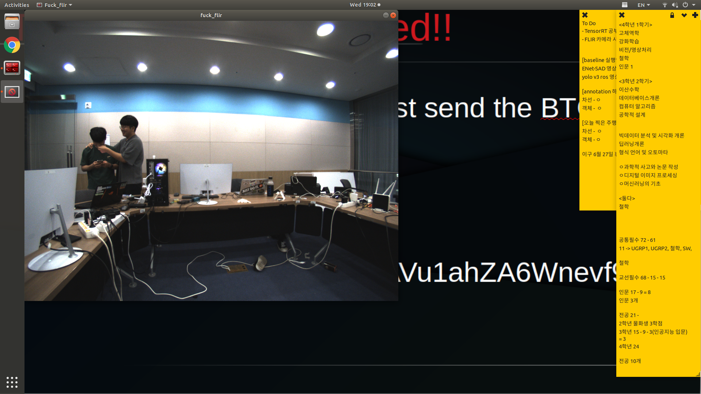

# 통합SW 연구개발 블로그

버튼이랑 GUI 만드는 팀인줄 알았으나, 자본금 60으로 스케줄링과 자가진단, 통신 체크를 전부 담당하게 되버린 ~비운의~ 팀

## 파트장 소개   
ARTIV의 귀여움 담당인 송씨이다.

||      

가끔 폭력적인 모습이 나오기도 한다.     
    
해당 모습은 하드웨어 파트장 호씨를 괴롭히는 모습이다.

### Devlog #1    
1. [통합SW 소개](introduction.md)  
2. ROS1-ROS2 bridge  
3. [Car status visualization program, ADMS](ADMS.md)  
4. Log Alert System  
5. ROS delay checker  
6. ARTIV self diagnosis program, Vanguard  

