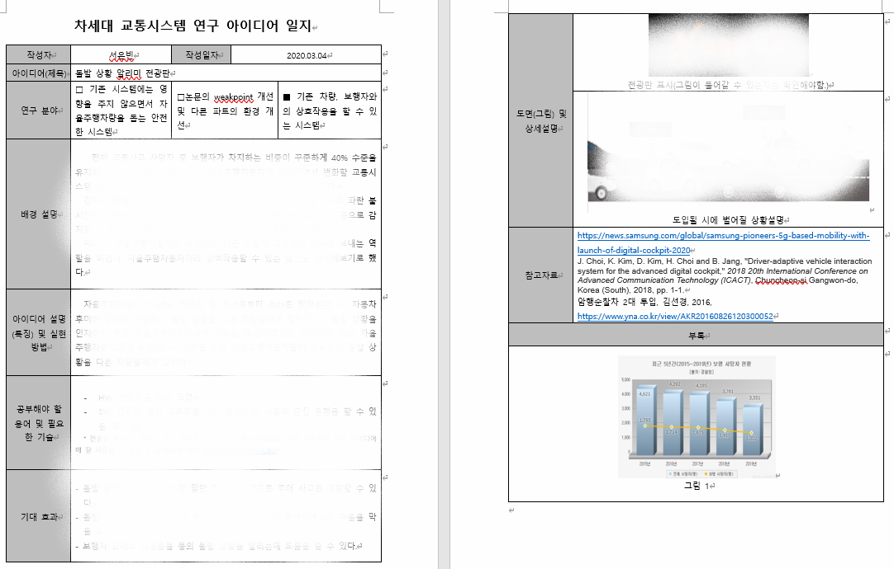

## 2. 아이디어 기록 남기기
Author : 서은빈
---
> 2020.04.05 part1에 이어 밀린 블로그를 급하게 적어보기로 했다ㅎㅎ

#### 아이디어 일지를 작성하기로 했다.
  2주(0305~0319)에 거쳐 아이디어를 내기 시작했다. 이전부터 가지고 있던 아이디어를 상세하게 생각해보기도 하고, 새로운 아이디어를 내기도 했다. 각자 지금껏 생각했던 아이디어를 문서화했는데, 아이디어에 대한 내용에 대해서 통일성이 필요해보였다. 그래서 아이디어 일지를 작성하기로 했다.

#### 아이디어 일지
  아이디어 일지라고 엄청나게 대단한건 아니다. 고등학생때 발명 일지를 토대로 아이디어 일지 양식을 만들었다. 아이디어 일지에는 다음과 같은 내용이 담겨있다.
- 아이디어 분야(part1 project scope를 참고)
- 아이디어가 나온 배경 설명
- 아이디어 설명(특징) 및 실현 방법
- 공부해야할 용어 및 필요한 기술
- 아이디어 가시화를 위한 도면(그림) 및 상세설명
- 참고자료
- 부록

> 우리 차세대 교통시스템 연구 팀은 아이디어 싸움이므로 내용은 비공개로..ㅎㅎ 정말 2주동안 아이디어 짜내는 것이 너무 힘들었다ㅠ 조금 더 세밀한 내용을 채워나가야 하겠지만...

#### 실현 가능성 정도 분석
아이디어가 총 16개가 나왔고, 이 아이디어를 어떤 것부터 만들어내야할지 결정하기 위해 나름대로의 기준을 두고 분석하기로 했다. 기준은 다음과 같다.
- 현재 나와있는 기술들을 얼마나 활용할 수 있는가?(활용성)
- 이 기술이 꼭 필요한가? (필요성)
- 약간의 변형으로 다른 아이디어에 적용할 수 있는가(확장성)
- 간단하게 test할 수 있는가
- 코로나 바이러스로 인해 대면하지 않은 상태에서도 진행할 수 있는가
이 기준으로 우리는 아이디어 세미나를 하게 되는데... 궁금하면 part3. 아이디어 세미나를 보러 갑시다!
